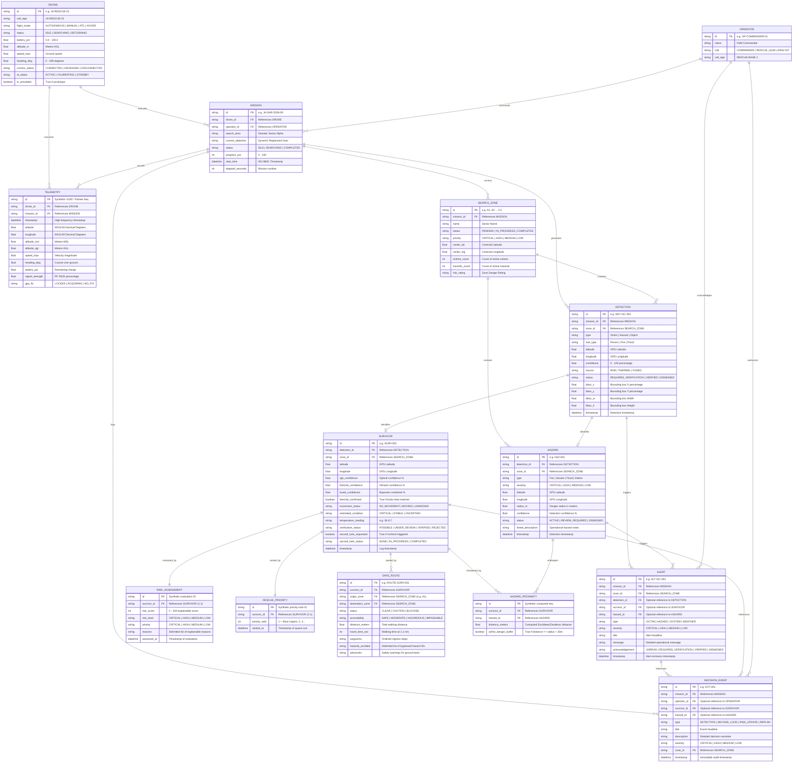

# JEEVAN-AIR: Logical Entity-Relationship (ER) Data Model
## Aerial Intelligence & Rescue Ground Control Station
### Smart India Hackathon 2026 — Problem Statement SIH26177 (Qualcomm Inc)
**Team: TEAM ZYNTAX**  
**Document Version:** 1.0.0  
**Scope:** Logical Data Architecture (Current In-Memory Structures vs. Future Persistent Database)  

---

> [!IMPORTANT]
> **STORAGE ARCHITECTURE DISCLOSURE:**  
> The current JEEVAN-AIR prototype **DOES NOT use a production relational database (RDBMS)**.  
> All entities, telemetry streams, survivor logs, hazard vectors, and decision timeline events currently reside in **in-memory TypeScript reactive state** managed by `SimulationDataProvider.ts` and `MissionContext.tsx`.  
> This document models the **LOGICAL DATA SCHEMA** derived directly from the application's domain types (`src/types/common.ts`, `src/types/index.ts`, and `src/hardware/types.ts`). It outlines both the **current simulated software data structures** and the **future persistent database schema** for physical deployment.

---

## Table of Contents

1. [Logical ER Diagram (Mermaid)](#1-logical-er-diagram-mermaid)
2. [Entity Descriptions & Attributes](#2-entity-descriptions--attributes)
   * [2.1 DRONE](#21-drone)
   * [2.2 MISSION](#22-mission)
   * [2.3 TELEMETRY](#23-telemetry)
   * [2.4 GPS_POSITION](#24-gps_position)
   * [2.5 SEARCH_ZONE](#25-search_zone)
   * [2.6 DETECTION](#26-detection)
   * [2.7 SURVIVOR](#27-survivor)
   * [2.8 HAZARD](#28-hazard)
   * [2.9 HAZARD_PROXIMITY (Associative Entity)](#29-hazard_proximity-associative-entity)
   * [2.10 RISK_ASSESSMENT](#210-risk_assessment)
   * [2.11 RESCUE_PRIORITY](#211-rescue_priority)
   * [2.12 SAFE_ROUTE](#212-safe_route)
   * [2.13 ALERT](#213-alert)
   * [2.14 DECISION_EVENT (Timeline)](#214-decision_event-timeline)
   * [2.15 OPERATOR](#215-operator)
3. [Relationship & Cardinality Explanations](#3-relationship--cardinality-explanations)
4. [Current Prototype Storage Model](#4-current-prototype-storage-model)
5. [Future Database Recommendation](#5-future-database-recommendation)
6. [Current Logical Model vs. Future Production Database](#6-current-logical-model-vs-future-production-database)
7. [Classification Summary](#7-classification-summary)

---

## 1. Logical ER Diagram (Mermaid)



---

## 2. Entity Descriptions & Attributes

### 2.1 DRONE
* **Code Reference:** `DroneState` in [`src/types/common.ts`](file:///Users/sheshagiri/jeevan%20air/src/types/common.ts#L70), `DroneStatus` in [`src/types/index.ts`](file:///Users/sheshagiri/jeevan%20air/src/types/index.ts#L20).
* **Description:** Represents the physical or simulated unmanned aerial vehicle executing search sorties.
* **Key Attributes:**
  - `id` (PK, string): Unique identifier, e.g. `'JA-RESCUE-01'`.
  - `flight_mode` (string): Current flight state (`'AUTONOMOUS'`, `'MANUAL'`, `'RTL'`, `'HOVER'`).
  - `status` (string): Mission readiness (`'IDLE'`, `'SEARCHING'`, `'RETURNING'`).
  - `battery_pct` (float): Charge percentage ($0.0\text{–}100.0\%$).
  - `altitude_m` (float): Current altitude Above Ground Level (AGL) in meters.
  - `speed_mps` (float): Ground velocity in meters per second.
  - `heading_deg` (float): Orientation heading ($0^\circ\text{–}359^\circ$).
  - `comms_status` (string): Communication state (`'SIMULATED — CONNECTED'`, `'DEGRADED'`, `'DISCONNECTED'`).
  - `is_simulated` (boolean): Flag denoting whether telemetry is synthetic (`true` in current prototype).

### 2.2 MISSION
* **Code Reference:** `MissionState` in [`src/types/common.ts`](file:///Users/sheshagiri/jeevan%20air/src/types/common.ts#L235), `MissionHistoryItem` in [`src/types/common.ts`](file:///Users/sheshagiri/jeevan%20air/src/types/common.ts#L210).
* **Description:** Defines an operational search-and-rescue deployment across assigned disaster sectors.
* **Key Attributes:**
  - `id` (PK, string): Mission tracking identifier, e.g. `'JA-SAR-2026-09'`.
  - `drone_id` (FK, string): References assigned UAV.
  - `search_area` (string): Textual designation of the operational area.
  - `current_objective` (string): Dynamic objective banner updated by the replanning engine.
  - `status` (string): Mission phase (`'IDLE'`, `'SEARCHING'`, `'PAUSED'`, `'COMPLETED'`).
  - `progress_pct` (int): Grid sweep completion ($0\text{–}100\%$).
  - `elapsed_seconds` (int): Total active flight duration.

### 2.3 TELEMETRY
* **Code Reference:** `Telemetry` in [`src/types/common.ts`](file:///Users/sheshagiri/jeevan%20air/src/types/common.ts#L59), `HardwareTelemetryPacket` in [`src/hardware/types.ts`](file:///Users/sheshagiri/jeevan%20air/src/hardware/types.ts#L430).
* **Description:** Time-series telemetry records streamed at $1\text{–}10\text{ Hz}$.
* **Key Attributes:**
  - `id` (PK, string): Packet sequence index or timestamp UUID.
  - `drone_id` (FK, string): Originating drone.
  - `mission_id` (FK, string): Associated mission.
  - `latitude` / `longitude` (float): WGS-84 geographical coordinates.
  - `altitude_msl` / `altitude_agl` (float): Height measurements in meters.
  - `signal_strength` (float): Received signal strength indication (RSSI %).
  - `timestamp` (datetime): Time of packet emission.

### 2.4 GPS_POSITION
* **Code Reference:** `GPSPosition` in [`src/types/common.ts`](file:///Users/sheshagiri/jeevan%20air/src/types/common.ts#L52), `GNSSPositionPayload` in [`src/hardware/types.ts`](file:///Users/sheshagiri/jeevan%20air/src/hardware/types.ts#L60).
* **Description:** Raw satellite positioning payload including fix quality metrics.
* **Key Attributes:**
  - `latitude` / `longitude` (float): Decimal degrees.
  - `satellite_count` (int): Number of visible GNSS space vehicles ($\ge 6$ required for 3D lock).
  - `hdop` (float): Horizontal dilution of precision ($< 2.0$ optimal).
  - `fix_type` (int): MAVLink GNSS fix quality ($0=\text{NoFix}, 3=\text{3D Fix}, 6=\text{RTK}$).

### 2.5 SEARCH_ZONE
* **Code Reference:** `SearchZone` in [`src/types/common.ts`](file:///Users/sheshagiri/jeevan%20air/src/types/common.ts#L185), `ZoneId` in [`src/types/common.ts`](file:///Users/sheshagiri/jeevan%20air/src/types/common.ts#L29).
* **Description:** Discretized tactical search sector within the 3×3 operational grid.
* **Key Attributes:**
  - `id` (PK, string): Sector code (`'A1'` through `'C3'`).
  - `name` (string): Descriptive label (e.g. `'Sector A1 (Northwest Staging)'`).
  - `status` (string): Coverage state (`'PENDING'`, `'IN_PROGRESS'`, `'COMPLETED'`).
  - `priority` (string): Urgency rating (`'CRITICAL'`, `'HIGH'`, `'MEDIUM'`, `'LOW'`).
  - `center_lat` / `center_lng` (float): Centroid GPS coordinates.
  - `victims_count` / `hazards_count` (int): Aggregated count of identified entities in the zone.

### 2.6 DETECTION
* **Code Reference:** `Detection` in [`src/types/common.ts`](file:///Users/sheshagiri/jeevan%20air/src/types/common.ts#L91), `RawAIDetection` / `FusedAIDetection` in [`src/ai/types.ts`](file:///Users/sheshagiri/jeevan%20air/src/ai/types.ts#L43).
* **Description:** Base visual or sensor observation generated by the optical/thermal vision pipeline before full entity triage.
* **Key Attributes:**
  - `id` (PK, string): Unique detection identifier, e.g. `'DET-VIC-1042'`.
  - `type` (string): Category (`'Victim'`, `'Hazard'`, `'Object'`).
  - `sub_type` (string): Specific class (`'Person'`, `'Fire'`, `'Flood'`).
  - `confidence` (float): Model confidence percentage ($0\text{–}100\%$).
  - `source` (string): Modality (`'RGB'`, `'THERMAL'`, `'FUSED'`).
  - `bbox_x`, `bbox_y`, `bbox_w`, `bbox_h` (float): Normalized percentage bounding box.

### 2.7 SURVIVOR
* **Code Reference:** `Survivor` in [`src/types/common.ts`](file:///Users/sheshagiri/jeevan%20air/src/types/common.ts#L108).
* **Description:** Person localized on the ground requiring extraction, validated through multi-spectral verification.
* **Key Attributes:**
  - `id` (PK, string): Survivor identifier, e.g. `'SURV-1042'`.
  - `detection_id` (FK, string): Originating visual detection.
  - `zone_id` (FK, string): Sector location (`'A1'`–`'C3'`).
  - `rgb_confidence` / `thermal_confidence` (float): Individual sensor confidences.
  - `fused_confidence` (float): Bayesian fused certainty.
  - `thermal_confirmed` (boolean): Flag indicating whether core biometric heat matches optical silhouette.
  - `movement_status` (string): Movement observation (`'NO_MOVEMENT'`, `'MOVEMENT_DETECTED'`, `'UNKNOWN'`).
  - `estimated_condition` (string): Condition triage (`'CRITICAL'`, `'STABLE'`, `'UNCERTAIN'`).
  - `verification_status` (string): Lifecycle state (`'POSSIBLE'`, `'UNDER_REVIEW'`, `'VERIFIED'`, `'REJECTED'`).
  - `second_look_requested` (boolean): Flag indicating autonomous recheck status.

### 2.8 HAZARD
* **Code Reference:** `Hazard` in [`src/types/common.ts`](file:///Users/sheshagiri/jeevan%20air/src/types/common.ts#L147), `HazardType` in [`src/types/common.ts`](file:///Users/sheshagiri/jeevan%20air/src/types/common.ts#L31).
* **Description:** Environmental threat posing danger to victims or ground rescue personnel.
* **Key Attributes:**
  - `id` (PK, string): Unique hazard code, e.g. `'HAZ-001'`.
  - `type` (string): Threat category (`'Fire'`, `'Smoke'`, `'Flood'`, `'Debris'`, `'Damaged Structure'`, `'Chemical Leak'`).
  - `severity` (string): Threat level (`'CRITICAL'`, `'HIGH'`, `'MEDIUM'`, `'LOW'`).
  - `radius_m` (float): Danger radius in meters (e.g. $50\text{m}$ for Fire, $35\text{m}$ for Debris).
  - `status` (string): Operational review state (`'ACTIVE'`, `'REVIEW REQUIRED'`, `'DISMISSED'`).

### 2.9 HAZARD_PROXIMITY (Associative Entity)
* **Code Reference:** Evaluated dynamically via `findNearbyHazards()` in [`src/services/rescueIntelligence.ts`](file:///Users/sheshagiri/jeevan%20air/src/services/rescueIntelligence.ts#L45).
* **Description:** Many-to-many relationship resolving spatial proximity between survivors and active hazards.
* **Key Attributes:**
  - `survivor_id` (FK, string)
  - `hazard_id` (FK, string)
  - `distance_meters` (float): Geodesic distance in meters between survivor and hazard.
  - `within_danger_buffer` (boolean): True if $\text{distance} \le \text{radius} + 35\text{m}$.

### 2.10 RISK_ASSESSMENT
* **Code Reference:** Calculated via `assessSurvivorRisk()` in [`src/services/rescueIntelligence.ts`](file:///Users/sheshagiri/jeevan%20air/src/services/rescueIntelligence.ts#L80).
* **Description:** Explainable multi-factor evaluation of a survivor's operational urgency.
* **Key Attributes:**
  - `survivor_id` (FK, string): 1:1 relationship with SURVIVOR.
  - `risk_score` (int): Composite score ($0\text{–}100$).
  - `risk_level` (string): Categorical level (`'CRITICAL'`, `'HIGH'`, `'MEDIUM'`, `'LOW'`).
  - `reasons` (string[]): Array of human-readable rationale strings.

### 2.11 RESCUE_PRIORITY
* **Code Reference:** Calculated via `prioritizeSurvivors()` in [`src/services/rescueIntelligence.ts`](file:///Users/sheshagiri/jeevan%20air/src/services/rescueIntelligence.ts#L175).
* **Description:** Relative sorting rank of active survivors for immediate field extraction.
* **Key Attributes:**
  - `survivor_id` (FK, string): 1:1 relationship with SURVIVOR.
  - `priority_rank` (int): Sequential rank ($1, 2, 3\dots$).

### 2.12 SAFE_ROUTE
* **Code Reference:** `SafeRoute` in [`src/types/common.ts`](file:///Users/sheshagiri/jeevan%20air/src/types/common.ts#L162), generated by `calculateSafeRoute()` in [`src/services/rescueIntelligence.ts`](file:///Users/sheshagiri/jeevan%20air/src/services/rescueIntelligence.ts#L225).
* **Description:** Recommended ground ingress corridor guiding rescue personnel from staging base to victim while avoiding hazard zones.
* **Key Attributes:**
  - `id` (PK, string): Route code, e.g. `'ROUTE-SURV-1042'`.
  - `survivor_id` (FK, string): Destination target.
  - `origin_zone` (string): Staging sector (`'A1'`).
  - `destination_zone` (string): Victim's sector.
  - `status` (string): Corridor feasibility (`'CLEAR'`, `'CAUTION'`, `'BLOCKED'`).
  - `accessibility` (string): Rating (`'SAFE'`, `'MODERATE'`, `'HAZARDOUS'`, `'IMPASSABLE'`).
  - `distance_meters` (float): Total walking distance.
  - `travel_time_sec` (int): Estimated transit time at $1.1\text{ m/s}$.
  - `waypoints` (json): Ordered sequence of sector steps (`Step #1 (A1) -> Step #2 (A2)...`).
  - `hazards_avoided` (string[]): IDs of dangerous hazards safely bypassed.

### 2.13 ALERT
* **Code Reference:** `Alert` in [`src/types/common.ts`](file:///Users/sheshagiri/jeevan%20air/src/types/common.ts#L195), [`src/types/index.ts`](file:///Users/sheshagiri/jeevan%20air/src/types/index.ts#L39).
* **Description:** Actionable notifications generated for operator attention.
* **Key Attributes:**
  - `id` (PK, string): Alert code, e.g. `'ALT-VIC-1042'`.
  - `type` (string): Source (`'VICTIM'`, `'HAZARD'`, `'SYSTEM'`, `'WEATHER'`).
  - `severity` (string): Priority level (`'CRITICAL'`, `'HIGH'`, `'MEDIUM'`, `'LOW'`).
  - `title` / `message` (string): Operational alert text.
  - `acknowledgement` (string): Status (`'UNREAD'`, `'REQUIRES_VERIFICATION'`, `'VERIFIED'`, `'DISMISSED'`).

### 2.14 DECISION_EVENT (Timeline)
* **Code Reference:** `DecisionTimelineEvent` in [`src/types/common.ts`](file:///Users/sheshagiri/jeevan%20air/src/types/common.ts#L173).
* **Description:** Immutable chronological audit record of operational decisions and autonomous adaptations.
* **Key Attributes:**
  - `id` (PK, string): Event code, e.g. `'EVT-001'`.
  - `mission_id` (FK, string): Parent mission.
  - `type` (string): Transition type (`'DETECTION'`, `'SECOND_LOOK_REQUEST'`, `'SECOND_LOOK_RESULT'`, `'RISK_UPDATE'`, `'PRIORITY_ASSIGNED'`, `'ROUTE_GENERATED'`, `'MISSION_REPLAN'`).
  - `title` / `description` (string): Narrative text.
  - `severity` (string): Severity weighting.
  - `timestamp` (datetime): Time of occurrence.

### 2.15 OPERATOR
* **Code Reference:** Implicitly modeled via manual override controls (`MissionContext.tsx`), user acknowledgment actions, and header profile states.
* **Description:** Tactical commander or first responder interacting with the GCS.
* **Key Attributes:**
  - `id` (PK, string): User identifier.
  - `name` (string): Personnel name.
  - `role` (string): Authorization role (`'COMMANDER'`, `'RESCUE_LEAD'`, `'ANALYST'`).

---

## 3. Relationship & Cardinality Explanations

| Relationship | Cardinality | Business / Operational Rule |
|---|---|---|
| **DRONE to MISSION** | $1 : N$ | A single drone executes multiple sequential search missions over time. |
| **DRONE to TELEMETRY** | $1 : N$ | A drone generates a continuous stream of time-series telemetry records. |
| **MISSION to SEARCH_ZONE** | $1 : N$ | A mission partitions its operational area across 9 tactical sectors (`A1`–`C3`). |
| **SEARCH_ZONE to DETECTION** | $1 : N$ | Multiple visual candidates (victims, hazards) can be detected within a single sector. |
| **DETECTION to SURVIVOR** | $0..1 : 1$ | A detection classified as `'Victim'` / `'Person'` resolves into exactly one `Survivor` entity. |
| **DETECTION to HAZARD** | $0..1 : 1$ | A detection classified as `'Hazard'` resolves into exactly one `Hazard` entity. |
| **SURVIVOR to RISK_ASSESSMENT** | $1 : 1$ | Every survivor has exactly one current computed explainable risk score and rationale. |
| **SURVIVOR to RESCUE_PRIORITY** | $1 : 1$ | Every survivor holds exactly one ordinal ranking position in the active triage queue. |
| **SURVIVOR to SAFE_ROUTE** | $1 : 0..1$ | Every survivor has at most one recommended ground access corridor computed from base. |
| **SURVIVOR to HAZARD (via HAZARD_PROXIMITY)** | $N : M$ | A survivor can be threatened by multiple nearby hazards; a single hazard can threaten multiple survivors. |
| **MISSION to DECISION_EVENT** | $1 : N$ | All major tactical events (replans, 2nd-looks, detections) are logged to the mission's audit timeline. |
| **OPERATOR to ALERT** | $1 : N$ | Operators review, verify, or dismiss alerts generated by the automated detection engine. |

---

## 4. Current Prototype Storage Model

### `[CURRENT PROTOTYPE]` / `[SIMULATED DATA]`

In the current software prototype, **no external database is running**. All entity storage is implemented via TypeScript in-memory structures:

```
┌─────────────────────────────────────────────────────────────────────────────┐
│                           IN-MEMORY BROWSER RUNTIME                         │
├─────────────────────────────────────────────────────────────────────────────┤
│  SimulationDataProvider (src/adapters/SimulationDataProvider.ts)            │
│  ├── private droneStatus: DroneStatus           (Singleton Drone State)     │
│  ├── private zones: SearchZone[]               (Array of 9 Tactical Sectors)│
│  ├── private detections: Detection[]           (Array of Visual Targets)    │
│  ├── private survivors: Survivor[]             (Array of Triage Victims)    │
│  ├── private hazards: Hazard[]                 (Array of Active Threats)    │
│  ├── private alerts: Alert[]                   (Array of System Alerts)     │
│  ├── private timelineEvents: DecisionEvent[]   (Array of Audit Records)     │
│  └── private missionHistory: HistoryItem[]     (Past Sortie Records)        │
│                                                                             │
│  MissionContext (src/context/MissionContext.tsx)                            │
│  └── React useState / useRef mirrors synced via subscribe() event bus      │
└─────────────────────────────────────────────────────────────────────────────┘
```

* **Persistence Lifespan:** Refreshing the browser resets the in-memory state to initial baseline fixtures defined in `src/data/mockData.ts`.
* **State Updates:** Modifications occur via setter methods on `SimulationDataProvider` (e.g. `simulateVictim()`, `requestSecondLook()`, `markAlertVerified()`), which trigger reactive listeners via `this.notify()`.

---

## 5. Future Database Recommendation

For the production hardware deployment of JEEVAN-AIR, the following database stack is recommended to support multi-modal aerial search-and-rescue:

### Primary RDBMS: PostgreSQL 16 + PostGIS Extension
* **Rationale:** Relational integrity for missions, survivors, hazards, and operators, combined with native geospatial indexing (`ST_DWithin`, `ST_Distance`, `ST_Contains`) for rapid hazard proximity analysis and polygon geofencing.

### Time-Series Extension: TimescaleDB (PostgreSQL plugin)
* **Rationale:** Optimized hypertable storage for high-frequency flight telemetry ($10\text{ Hz}$ GPS, IMU, battery, and MAVLink packets) with automated data retention policies.

### Real-Time In-Memory Cache: Redis 7
* **Rationale:** Sub-millisecond pub/sub message broker between the edge computer WebSocket bridge and connected Ground Control Stations, holding active drone positions and transient alert queues.

### Object Storage: MinIO / Local Edge Disk
* **Rationale:** Storage of raw multi-spectral camera frames, high-resolution thermal radiometric matrices, and video snippets tagged with detection UUIDs.

---

## 6. Difference: Current Logical Model vs. Future Production Database

| Architectural Dimension | Current Software Prototype | Future Production Deployment |
|---|---|---|
| **Storage Medium** | Browser JavaScript RAM (In-Memory) | PostgreSQL 16 + PostGIS + TimescaleDB |
| **Data Persistence** | Ephemeral (Lost on page refresh) | Persistent ACID transactions across disk/RAID |
| **Geospatial Processing** | Planar Euclidean math in TypeScript (`findNearbyHazards`) | Native PostGIS spherical spatial indexing (`ST_DWithin`) |
| **Telemetry Ingestion** | Synthetic timer intervals ($1000\text{ms}$) | MAVLink 2.0 binary packet stream via edge bridge ($10\text{Hz}$) |
| **Relational Integrity** | Managed in code via TypeScript arrays and object mapping | Enforced Foreign Key (FK) constraints, cascading updates, unique indices |
| **Multi-Operator Access** | Single-browser session | Multi-client synchronization via WebSockets and Redis Pub/Sub |
| **Audit Logging** | In-memory `DecisionTimelineEvent[]` array | Immutable append-only audit ledger with cryptographic timestamps |

---

## 7. Classification Summary

* `[CURRENT PROTOTYPE]` Represents the logical relationships and entity structures currently active in TypeScript interfaces across `src/types/common.ts`, `src/services/rescueIntelligence.ts`, and `src/adapters/SimulationDataProvider.ts`.
* `[SIMULATED DATA]` All instances of `DRONE`, `TELEMETRY`, `GPS_POSITION`, and environmental `HAZARD` entities are populated mathematically without physical hardware.
* `[FUTURE PERSISTENT STORAGE]` The formal schema documented above serves as the direct blueprint for generating database migrations (`prisma/schema.prisma` or PostgreSQL DDL) in Phase 4/5 physical deployment.
