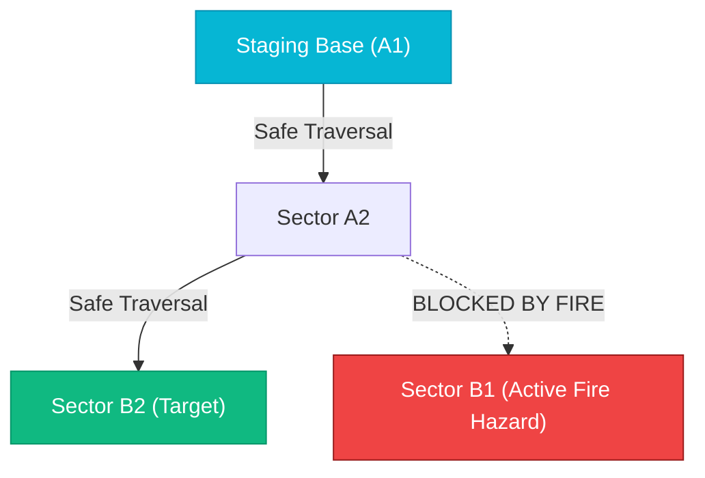
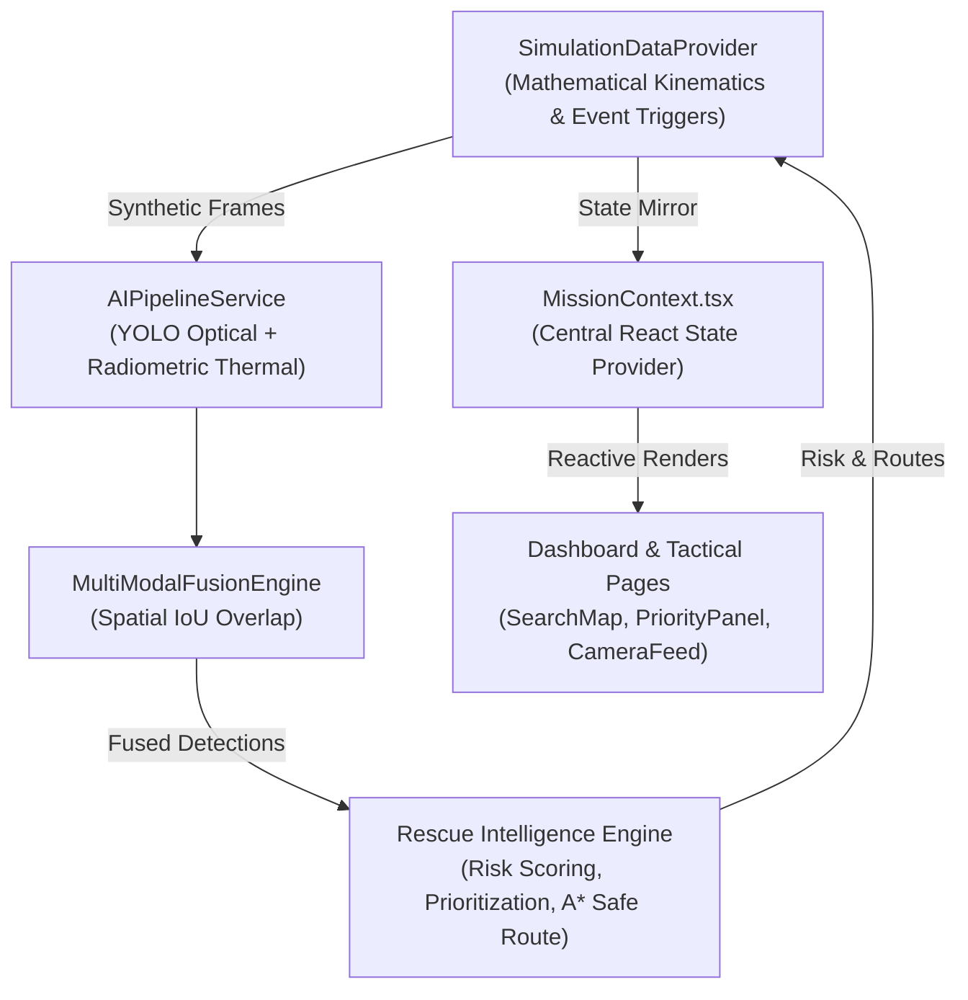

# JEEVAN-AIR: Software Prototype Specification
## Ground Control Station & Rescue Intelligence Dashboard
### Smart India Hackathon 2026 — Problem Statement SIH26177 (Qualcomm Inc)
**Team: TEAM ZYNTAX**  
**Document Version:** 1.0.0  
**Scope:** Current Software Prototype Only  

---

> [!IMPORTANT]
> **PHYSICAL HARDWARE DISCLAIMER:**  
> The physical drone hardware **DOES NOT EXIST YET**.  
> The current JEEVAN-AIR prototype is a **web-based Ground Control Station (GCS) and software decision-support prototype**.  
> All drone flight movements, GPS coordinates, camera video feeds, thermal imaging readings, and battery levels are **mathematically simulated in software**.  
> This document describes strictly what is implemented and functional in the software today. It does not claim real drone hardware or live flight capabilities.

---

## Table of Contents

1. [Prototype Overview](#1-prototype-overview)
2. [Prototype Objective](#2-prototype-objective)
3. [Current Features](#3-current-features)
4. [Dashboard Overview](#4-dashboard-overview)
5. [Simulated Drone Telemetry](#5-simulated-drone-telemetry)
6. [Simulated GPS](#6-simulated-gps)
7. [Survivor Detection Interface](#7-survivor-detection-interface)
8. [Hazard Detection Interface](#8-hazard-detection-interface)
9. [Risk Assessment](#9-risk-assessment)
10. [Rescue Prioritization](#10-rescue-prioritization)
11. [Second-Look Verification](#11-second-look-verification)
12. [Safe-Access Guidance](#12-safe-access-guidance)
13. [Mission Replanning](#13-mission-replanning)
14. [Alerts](#14-alerts)
15. [Map / Geospatial View](#15-map--geospatial-view)
16. [Drone Status](#16-drone-status)
17. [Connectivity Status](#17-connectivity-status)
18. [Current Data Flow](#18-current-data-flow)
19. [Current Technology Stack](#19-current-technology-stack)
20. [Current Limitations](#20-current-limitations)
21. [Future Hardware Integration](#21-future-hardware-integration)
22. [Feature Classification: Implemented, Simulated, Planned](#22-feature-classification-implemented-simulated-planned)
23. [How the Prototype Connects to Future Hardware](#23-how-the-prototype-connects-to-future-hardware)

---

## 1. Prototype Overview

The current **JEEVAN-AIR prototype** is an interactive, browser-based tactical command center for aerial search-and-rescue operations. 

It is designed to serve as the operator's interface during disaster response scenarios such as flash floods, building collapses, and industrial fires. The software models the end-to-end workflow of an autonomous rescue drone from aerial scanning to victim prioritization and ground rescue routing.

* **Repository:** [https://github.com/Srisharadhakrishnan/SIH26177](https://github.com/Srisharadhakrishnan/SIH26177)
* **Local Access URL:** `http://localhost:5180/`
* **Current Operational Mode:** `SIMULATION MODE` (Active by default in `src/hardware/config.ts`)

---

## 2. Prototype Objective

The objective of this software prototype is to demonstrate and validate the **intelligence and decision-making logic** of JEEVAN-AIR before physical hardware is procured and integrated:

1. **Verify the Operational Chain:** Prove that the software can take raw detections, assess multi-factor risk, prioritize victims by urgency, and generate safe ground rescue routes:
   $$\text{DETECT} \longrightarrow \text{VERIFY} \longrightarrow \text{ASSESS} \longrightarrow \text{PRIORITIZE} \longrightarrow \text{GUIDE}$$
2. **Validate the User Experience:** Provide first-responder commanders with an uncluttered, high-contrast, tactical dashboard that surfaces actionable intelligence rather than raw, overwhelming data streams.
3. **Establish Software-Hardware Boundaries:** Decouple data generation from data presentation using an adapter architecture (`IDataAdapter`), ensuring the GCS dashboard will connect to a physical drone later with **zero UI rewrites**.

---

## 3. Current Features

The software prototype currently provides:

* **Interactive Tactical Command Center:** 11 dedicated screens accessible via sidebar navigation.
* **Simulated Telemetry Engine:** Mathematical generation of speed, altitude, battery discharge, heading, and GPS position along a lawn-mower sweep path.
* **Multi-Modal AI Vision Pipeline:** Abstraction layer for optical YOLO person detection, radiometric thermal scanning, and spatial Intersection-over-Union (IoU) sensor fusion.
* **Explainable Risk Assessment:** Multi-factor scoring (0–100) factoring victim entrapment, estimated condition, thermal verification, hazard proximity, and terrain.
* **Operational Rescue Prioritization Queue:** Dynamic ranking of survivors (`Priority #1`, `Priority #2`, etc.) with transparent operational reasons.
* **Autonomous Second-Look Verification:** Multi-spectral re-examination workflow to confirm or reject ambiguous candidate detections.
* **Safe-Access Ground Routing:** A* pathfinding on a 3×3 tactical sector grid, calculating safe foot corridors for ground teams that bypass active fire and chemical hazards.
* **Dynamic Mission Replanning:** Adaptive mission objectives that automatically retarget the drone upon discovering high-risk victims or severe threats.
* **Hardware Integration Dashboard:** A pre-flight readiness checklist tracking 18 physical subsystem milestones.
* **Interactive Scenario Injections:** Manual trigger buttons to inject victims, low-confidence targets, and environmental hazards during live demonstrations.

---

## 4. Dashboard Overview

### Primary Screen: Tactical Command Center (`src/pages/DashboardPage.tsx`)

The main dashboard is organized into distinct tactical modules:

```
┌────────────────────────────────────────────────────────────────────────────────────────┐
│ [HEADER] Call Sign: JA-RESCUE-01 | SIMULATED FLIGHT TELEMETRY | SIMULATED — CONNECTED  │
├────────────────────────────────────────────────────────────────────────────────────────┤
│ [STAT CARDS] Active Mission (Elapsed) | Survivors (Ranked) | Hazards | Zones Surveyed  │
├────────────────────────────────────────────────────────────────────────────────────────┤
│ [MISSION OBJECTIVE STRIP] Dynamic Objective (e.g. PRIORITY REPLAN: Monitor Victim B2) │
├────────────────────────────────────────────────────────────────────────────────────────┤
│ [CONTROLS BAR] Start | Pause | Resume | RTL | Demo | Manual | +Victim | +Uncertain | +Haz│
├──────────────────────────────────────────┬─────────────────────────────────────────────┤
│ [LEFT COLUMN - 7 COLS]                   │ [RIGHT COLUMN - 5 COLS]                     │
│ 1. Multi-Spectral Camera Feed Viewport    │ 1. Drone Telemetry Card                     │
│    (RGB / Thermal / AI Overlay Modes)    │    (Altitude, Speed, Battery, Heading, GPS) │
│ 2. Tactical GIS Sector Map (3×3 Grid)    │ 2. Real-Time Alert Stream                   │
│    (Flight Track + Ground Safe Corridor) │    (Severity Badges, Verification Actions)  │
├──────────────────────────────────────────┴─────────────────────────────────────────────┤
│ [AI INFERENCE PANEL] YOLOv8 Optical + LWIR Radiometric | Measured Latency | Fallback   │
├────────────────────────────────────────────────────────────────────────────────────────┤
│ [RESCUE PRIORITY PANEL] Ranked Queue (#1, #2) | Explainable Decision Card | Safe Route │
├────────────────────────────────────────────────────────────────────────────────────────┤
│ [DECISION TIMELINE] Chronological Audit Log of Detections, Replans & Risk Updates      │
└────────────────────────────────────────────────────────────────────────────────────────┘
```

#### What the User Sees:
* Top statistics showing surveyed sectors (`X / 9`), active survivors, and mission time.
* Live multi-spectral camera viewport with crosshairs and tactical HUD overlay.
* Interactive 3×3 sector map displaying both the drone flight route and ground responder corridors.
* Live telemetry gauges displaying battery percentage, altitude, speed, and GPS status.
* Explainable triage card displaying exactly why a victim is ranked `Priority #1`.

#### What the Software Does:
* Subscribes to the active data provider via `MissionContext.tsx`.
* Updates all UI elements reactively at 1 Hz (or on user-triggered events).
* Recomputes survivor risk, priority queues, and ground paths whenever new detections or hazards are added.

---

## 5. Simulated Drone Telemetry

### Implementation: `SimulationDataProvider.ts` (lines 62–88, 220–290)

The prototype generates synthetic flight telemetry modeled on a medium-lift SAR quadcopter:

| Telemetry Parameter | Value / Range | Simulation Mechanism | UI Presentation |
|---|---|---|---|
| **Call Sign** | `JA-RESCUE-01` | Fixed identifier | Header & Drone Status Card |
| **Altitude** | $32.0\text{ m AGL}$ | Fixed search altitude with slight $\pm 0.4\text{ m}$ hover noise | Numeric gauge + progress bar |
| **Ground Speed** | $0.0\text{ m/s}$ (hover) to $3.5\text{ m/s}$ (transit) | Kinematic step calculation based on waypoint distance | Numeric gauge |
| **Heading** | $0^\circ\text{–}359^\circ$ | Computed as tangent between successive waypoints | Compass indicator ($45^\circ$) |
| **Battery Level** | $98\% \to 0\%$ | Decrements by $\approx 0.05\%$ per second during flight | Color-coded bar (Green $>50\%$, Yellow $>25\%$, Red $<25\%$) |
| **Estimated Flight Time**| $\approx 22\text{ minutes}$ | Derived from remaining battery capacity | Numeric readout |
| **Signal Strength** | $92\%\text{–}96\%$ | Fluctuate slightly to emulate RF link stability | Signal bars indicator |

> **Transparency Note:** No real sensors, IMUs, or barometers are connected. All values are calculated in software.

---

## 6. Simulated GPS

### Implementation: `SimulationDataProvider.ts` (lines 240–310) & `mockData.ts`

The prototype's geospatial coordinates are centered on a real-world disaster scenario near Chennai, India:

* **Base Reference Coordinate:** $13.0827^\circ\text{ N}, 80.2707^\circ\text{ E}$
* **Disaster Grid:** 9 rectangular tactical sectors arranged in a 3×3 grid:
  - Row A: `A1` (Northwest / Staging Base), `A2` (North), `A3` (Northeast)
  - Row B: `B1` (West), `B2` (Central Urban Core), `B3` (East Flood Basin)
  - Row C: `C1` (Southwest), `C2` (South Industrial Zone), `C3` (Southeast Canal)
* **Sector Size:** Each sector spans approximately $150\text{ m} \times 150\text{ m}$ ($\approx 0.0013^\circ$ latitude/longitude).
* **Autonomous Search Route:** 10 sequential waypoints forming an overlapping lawn-mower sweep across all 9 sectors.

#### What the User Sees:
* An interactive map showing the drone icon moving smoothly from waypoint to waypoint across sector boundaries.
* GPS fix status clearly labeled: `SIMULATED — LOCKED (3D FIX)`.

#### What the Software Does:
* Interpolates drone position along the waypoint trajectory every $1000\text{ ms}$.
* Checks if the drone has crossed into a new sector and updates `droneStatus.currentZone`.

---

## 7. Survivor Detection Interface

### Implementation: `src/ai/YoloVisionProvider.ts`, `src/ai/MultiModalFusionEngine.ts`, `DetectionsPage.tsx`

The survivor detection interface simulates an onboard computer vision pipeline detecting humans on the ground:

#### What the User Sees:
* Visual detection boxes on the camera feed highlighting detected individuals.
* Confidences displayed as percentages (e.g. `94% Optical`, `91% Thermal`).
* Estimated condition tags: `CRITICAL`, `STABLE`, or `UNCERTAIN`.
* Body temperature estimates: e.g. `36.8°C (Verified Heat Signature)`.
* Priority rank badges: `#1`, `#2`, `#3` on both the map and the detections table.

#### What the Software Does:
1. `YoloVisionProvider` extracts candidate human silhouettes from frame metadata.
2. `ThermalProcessingProvider` verifies whether matching radiometric heat signatures exist ($35.5^\circ\text{C}\text{–}38.2^\circ\text{C}$).
3. `MultiModalFusionEngine` correlates optical and thermal bounding boxes using spatial IoU ($\ge 0.20$).
4. Converts fused detections into standardized `Survivor` objects in the Common Data Model.

> **Transparency Note:** Video frames and bounding boxes are rendered using SVG and HTML5 Canvas overlays over simulated video streams.

---

## 8. Hazard Detection Interface

### Implementation: `src/ai/HazardDetectionProvider.ts`, `HazardsPage.tsx`

The prototype actively tracks environmental hazards that could endanger survivors or ground responders:

#### Supported Hazard Categories:
1. **Fire:** High thermal emission, combustion threshold ($> 60^\circ\text{C}$).
2. **Smoke:** Optical contrast attenuation and aerosol dispersion.
3. **Flood / Flooded Area:** Low-texture specular water reflections.
4. **Debris:** Structural rubble and blocked pathways.
5. **Damaged Structure:** Compromised buildings with collapse potential.
6. **Landslide:** Earth movement and mudflows.
7. **Electrical Hazard:** Downed power lines and sparking.
8. **Chemical Leak:** Hazardous industrial vapor plumes.

#### What the User Sees:
* Red circular danger rings on the tactical map showing hazard locations and affected radii ($35\text{ m}\text{–}50\text{ m}$).
* Detailed hazard ledger on `HazardsPage.tsx` showing coordinates, severity, and nearby survivors.

#### What the Software Does:
* Maintains hazard entities in `SimulationDataProvider.ts`.
* Dynamically evaluates spatial proximity between each survivor and all active hazards.

---

## 9. Risk Assessment

### Implementation: `src/services/rescueIntelligence.ts` (`assessSurvivorRisk()`)

The prototype calculates an explainable risk score ($0\text{–}100$) for every detected survivor using five weighted operational factors:

$$\text{Risk Score} = S_{\text{movement}} + S_{\text{condition}} + S_{\text{thermal}} + S_{\text{hazard}} + S_{\text{terrain}}$$

1. **Movement Status ($0\text{–}30\text{ pts}$):**
   - `NO_MOVEMENT` / `STATIC`: $+28\text{ pts}$ (Entrapment / incapacitation risk)
   - `UNKNOWN`: $+15\text{ pts}$
   - `MOVEMENT_DETECTED`: $+10\text{ pts}$ (Active movement observed)
2. **Estimated Condition ($0\text{–}25\text{ pts}$):**
   - `CRITICAL`: $+25\text{ pts}$
   - `UNCERTAIN`: $+18\text{ pts}$
   - `STABLE`: $+8\text{ pts}$
3. **Thermal Confirmation ($0\text{–}15\text{ pts}$):**
   - Verified biometric heat ($35.5^\circ\text{C}\text{–}38.2^\circ\text{C}$): $+15\text{ pts}$
   - Unconfirmed / weak heat: $+5\text{ pts}$
4. **Hazard Proximity ($0\text{–}20\text{ pts}$):**
   - Within buffer of Critical hazard (Fire/Chemical): $+20\text{ pts}$
   - Within buffer of High hazard (Flood): $+15\text{ pts}$
   - Distant threat ($> 50\text{ m}$): $+0\text{ pts}$
5. **Terrain Accessibility ($0\text{–}10\text{ pts}$):**
   - Impassable / flooded sector: $+10\text{ pts}$
   - Debris-strewn sector: $+5\text{ pts}$
   - Clear sector: $+2\text{ pts}$

#### What the User Sees:
An **Explainable Decision Card** on the dashboard displaying:
* Risk level badge (`CRITICAL`, `HIGH`, `MEDIUM`, `LOW`).
* Exact score breakdown (e.g. `88 / 100`).
* Bulleted operational reasons: *"No movement detected: high risk of entrapment"*, *"Extreme proximity to critical threat: Fire (~32m)"*.

---

## 10. Rescue Prioritization

### Implementation: `src/services/rescueIntelligence.ts` (`prioritizeSurvivors()`)

#### What the User Sees:
The **Rescue Priority Queue** card displaying survivors ordered by operational urgency:
* **Priority #1:** Most critical victim requiring immediate extraction.
* **Priority #2:** Next most critical victim.
* **Priority #3...:** Subsequent victims.

#### What the Software Does:
1. Filters out rejected false positives (from second-look workflows).
2. Sorts active survivors primarily by descending `riskScore`.
3. Resolves ties using sensor confidence scores.
4. Assigns sequential `priorityRank` numbers ($1, 2, 3\dots$).
5. Updates priority badges across the dashboard, map, and detection modals.

---

## 11. Second-Look Verification

### Implementation: `src/services/rescueIntelligence.ts` (`executeSecondLookResolution()`)

Addresses the critical problem of optical false positives (e.g. blankets, shadows, mannequins):

#### What the User Sees:
* When an uncertain victim is detected, an amber banner appears: `VERIFICATION NEEDED (POSSIBLE)`.
* A button labeled **`REQUEST SECOND LOOK`** becomes active.
* Clicking the button changes status to `SECOND-LOOK IN PROGRESS` while the system simulates multi-spectral re-examination.
* The target resolves to either `VERIFIED` (green) or `REJECTED` (grayed out).

#### What the Software Does:
1. Spawns candidate with `verificationStatus: 'POSSIBLE'` and `secondLookStatus: 'NONE'`.
2. On request, transitions to `secondLookStatus: 'IN_PROGRESS'` and logs a `SECOND_LOOK_REQUEST` event.
3. Evaluates simulated multi-spectral recheck:
   - If optical confidence $\ge 65\%$ or thermal heat is confirmed, upgrades to `VERIFIED` ($C \ge 88\%$).
   - Otherwise, sets status to `REJECTED` (*"False positive: thermal verification confirmed inanimate debris"*).
4. Re-ranks the priority queue and logs `SECOND_LOOK_RESULT` to the timeline.

---

## 12. Safe-Access Guidance

### Implementation: `src/services/rescueIntelligence.ts` (`calculateSafeRoute()`)

Calculates safe foot navigation corridors for ground rescue teams:



#### What the User Sees:
* **Tactical Map:** An emerald dashed corridor with step markers (`Ingress Step #1`, `Step #2`...) leading from the staging base (`A1`) to the victim.
* **Safe Route Card:** Total distance (e.g. `280 m`), estimated walking time (e.g. `4.2 min` at $1.1\text{ m/s}$), avoided hazard warnings, and terrain advisories.
* **Blocked Scenario:** If fires block all access, displays a red `ACCESS BLOCKED — IMPASSABLE` warning.

#### What the Software Does:
* Models sectors as a 4-connected graph.
* Marks sectors containing active `CRITICAL` hazards (Fire, Chemical Leak) as impassable obstacles.
* Runs A* / BFS to find the shortest path that completely avoids blocked sectors.

---

## 13. Mission Replanning

### Implementation: `SimulationDataProvider.ts` (lines 695–699, 930–950)

#### What the User Sees:
A high-contrast banner at the top of the dashboard (`MissionObjectiveBanner.tsx`):
* **Default:** *"AUTONOMOUS SWEEP: Executing systematic lawn-mower search across Sector Grid A1–C3"*
* **Upon Incident:** Automatically shifts to: *"PRIORITY REPLAN: Monitor & guide responder approach to Survivor SURV-XXXX in Sector B2"*

#### What the Software Does:
* Evaluates incoming incidents. If a `CRITICAL` victim or severe hazard is detected, overrides the standard search objective.
* Emits a `MISSION_REPLAN` event to the Decision Timeline.

---

## 14. Alerts

### Implementation: `src/components/alerts/AlertPanel.tsx`, `AlertsPage.tsx`

#### What the User Sees:
* Color-coded notification cards with urgency tags: `CRITICAL` (red), `HIGH` (orange), `MEDIUM` (amber), `LOW` (cyan).
* Quick-action buttons on each alert: `VERIFY` and `DISMISS`.
* Unverified alert count badge in the sidebar.

#### What the Software Does:
* Automatically creates alerts whenever a victim is detected, risk is updated, or a hazard expands.
* Tracks acknowledgement status: `UNREAD` $\to$ `REQUIRES_VERIFICATION` $\to$ `VERIFIED` or `DISMISSED`.

---

## 15. Map / Geospatial View

### Implementation: `src/components/map/SearchMap.tsx`, `SearchMapPage.tsx`

#### What the User Sees:
* 3×3 grid representing tactical disaster sectors `A1` to `C3`.
* Cyan path with directional arrows showing the drone's aerial flight route.
* Pulsing cyan drone icon with heading indicator.
* Orange human icons marking detected survivor locations with priority rank badges (`#1`, `#2`).
* Red pulsing circles marking active hazards with radius boundaries.
* Emerald dashed path with step badges showing the ground responder safe ingress corridor.
* Clear visual legend distinguishing the **Drone Aerial Flight Route** from the **Ground Safe Corridor**.

---

## 16. Drone Status

### Implementation: `src/components/drone/DroneStatusCard.tsx`

#### What the User Sees:
* Drone Call Sign: `JA-RESCUE-01`
* Flight Mode: `AUTONOMOUS` | `MANUAL` | `RTL` | `HOVER`
* Flight Controller: `NOT CONNECTED (SIMULATED ROUTE)`
* AI Status: `ACTIVE`
* Battery: Level bar and percentage (e.g. `98%`)
* Altitude: Gauge and numeric readout ($32\text{ m AGL}$)
* Speed: Numeric readout ($0.0\text{–}3.5\text{ m/s}$)
* Heading: Compass dial ($45^\circ\text{ NE}$)
* Comms Status: `SIMULATED — CONNECTED`

---

## 17. Connectivity Status

### Implementation: `src/adapters/SimulationDataProvider.ts` (`setConnectivity()`)

The prototype models telemetry connection health:
* **`SIMULATED — CONNECTED` (Default):** Full telemetry streaming, green status badges.
* **`SIMULATED — DEGRADED`:** Yellow status badge, warning message indicating potential packet drops.
* **`SIMULATED — DISCONNECTED`:** Red status badge, telemetry freeze, automated Return-To-Launch (RTL) fail-safe advisory.

---

## 18. Current Data Flow



---

## 19. Current Technology Stack

| Component | Technology | Version | Purpose |
|---|---|---|---|
| **Language** | TypeScript | 5.6.3 | Type-safe domain models, algorithms, and interfaces |
| **UI Framework** | React | 18.3.1 | Reactive component tree and state management |
| **Build Tool** | Vite | 5.4.8 | Development server with fast HMR and production bundling |
| **CSS Framework** | Tailwind CSS | 3.4.14 | Responsive, utility-first tactical dark styling |
| **Icons** | Lucide React | 1.16.0 | Tactical iconography (drones, radars, hazards, victims) |
| **Test Runner** | tsx | Native | Command-line execution of TypeScript test suites |
| **Runtime** | Node.js | v22.6.0 | Host execution environment |
| **Server Port** | Port 5180 | Configured in `vite.config.ts` | Eliminates port collisions with other local dev servers |

---

## 20. Current Limitations

1. **No Physical Drone:** The quadcopter airframe, motors, ESCs, propellers, and battery pack have not been assembled.
2. **No Hardware Sensors:** Optical cameras (Sony IMX477) and thermal cameras (FLIR Boson) are not physically connected. Video feeds are synthetic Canvas/SVG overlays.
3. **No Hardware Telemetry Link:** Telemetry is generated algorithmically in memory. No physical MAVLink 2.0 radio link or Pixhawk autopilot is communicating.
4. **Discrete Sector Graph:** Ground safe-access routing operates over 9 coarse grid cells ($150\text{ m} \times 150\text{ m}$) rather than continuous metric elevation maps.
5. **In-Browser Execution:** AI inference benchmarks are measured on the host browser CPU rather than on dedicated NVIDIA Jetson TensorRT hardware.

---

## 21. Future Hardware Integration

The prototype has been engineered specifically to prepare for physical hardware:

* **Abstraction Contract:** All dashboard components communicate strictly through `IDataAdapter`.
* **Hardware Provider Stub (`src/adapters/HardwareDataProvider.ts`):** Already written with complete stub methods for MAVLink packet ingestion.
* **Telemetry Schemas (`src/hardware/types.ts`):** Defines typed interfaces for all 10 hardware subsystems (`FlightControllerTelemetry`, `GNSSPositionPayload`, `IMUAttitudePayload`, etc.).
* **Single Configuration Switch (`src/hardware/config.ts`):** Switching the entire application from simulation to live hardware requires changing a single line:
  ```typescript
  export const SIMULATION_MODE: boolean = false;
  ```
  **Zero dashboard components will need to be rewritten.**

---

## 22. Feature Classification: Implemented, Simulated, Planned

### CURRENTLY IMPLEMENTED (Actually Works in Software Today):
* Common Data Model (`src/types/common.ts`).
* Data Provider Abstraction (`IDataAdapter`, `providerFactory.ts`).
* Explainable Risk Assessment Engine (multi-factor 0–100 scoring).
* Operational Rescue Prioritization Queue (ranking #1, #2, #3).
* Spatial Hazard Proximity Analysis ($r + 35\text{ m}$ buffer).
* A* Ground Responder Safe-Access Pathfinding avoiding hazard sectors.
* Autonomous Second-Look Verification workflow.
* Dynamic Mission Replanning and Decision Timeline logging.
* Multi-Modal AI Sensor Fusion Engine (spatial IoU correlation).
* AI Pipeline measured latency benchmarking via `performance.now()`.
* Simulation Fallback Mode toggle in AI panel.
* 11 interactive Ground Control Station pages with dark tactical theme.
* Automated Test Suites (85 total assertions passing 100%).

### SIMULATED (Generated Mathematically in Software):
* Drone GPS position and waypoint stepping along search path.
* Drone altitude ($32\text{ m AGL}$), ground speed ($3.5\text{ m/s}$), and heading ($45^\circ$).
* Battery discharge curve ($98\% \to 0\%$).
* Communication signal strength ($92\%\text{–}96\%$) and link quality states.
* Optical RGB camera video stream and survivor bounding boxes.
* Radiometric thermal infrared video feed and temperature readings ($36.8^\circ\text{C}$).
* Disaster environment sectors (`A1` to `C3`) and simulated hazard incidents.

### PLANNED (Requires Physical Drone & Hardware Integration):
* Physical UAV quadcopter airframe and propulsion system.
* Pixhawk 6C autopilot running ArduCopter / PX4.
* Physical MAVLink 2.0 serial telemetry bridge over RF radio (Holybro SiK v3 900MHz).
* Physical u-blox NEO-M9N GNSS receiver with 3D satellite fix.
* Physical optical camera payload (Sony IMX477) with gimbal stabilization.
* Physical radiometric thermal camera payload (FLIR Boson+ 320).
* Onboard edge computer (NVIDIA Jetson Orin Nano) running TensorRT YOLOv8.
* JeevanAir Edge Bridge (Python/FastAPI) streaming telemetry and video over WebSocket/RTSP.
* Cellular 4G/LTE failover communication link.

---

## 23. How the Prototype Connects to Future Hardware

When the physical drone is constructed, the integration will follow three clean steps:

```
[ PHYSICAL DRONE ]
  Pixhawk 6C Autopilot  ── UART MAVLink 2.0 ──►  NVIDIA Jetson Orin Nano
  Cameras (RGB + LWIR)  ── CSI / USB3-C   ──►  (Edge Computer)
                                                        │
                                                        ▼
                                          [ JeevanAir Edge Bridge ]
                                          (Python FastAPI WebSocket)
                                                        │
                                                        │ WebSocket JSON (Port 8765)
                                                        ▼
                                          [ HardwareDataProvider.ts ]
                                          (src/adapters/HardwareDataProvider.ts)
                                                        │
                                                        │ IDataAdapter
                                                        ▼
                                          [ GCS Dashboard UI ]
                                          (Unchanged — Zero Code Edits)
```

1. **Deploy Edge Bridge:** A lightweight Python/FastAPI service on the Jetson Orin Nano reads MAVLink from the Pixhawk and publishes `HardwareTelemetryPacket` JSON objects over WebSocket at 10 Hz.
2. **Switch Configuration:** In `src/hardware/config.ts`, set `SIMULATION_MODE = false` and specify the Jetson's IP address.
3. **Run Dashboard:** `providerFactory.ts` automatically instantiates `HardwareDataProvider`, feeding live drone telemetry directly into the existing, fully validated Rescue Intelligence Engine and dashboard pages.
