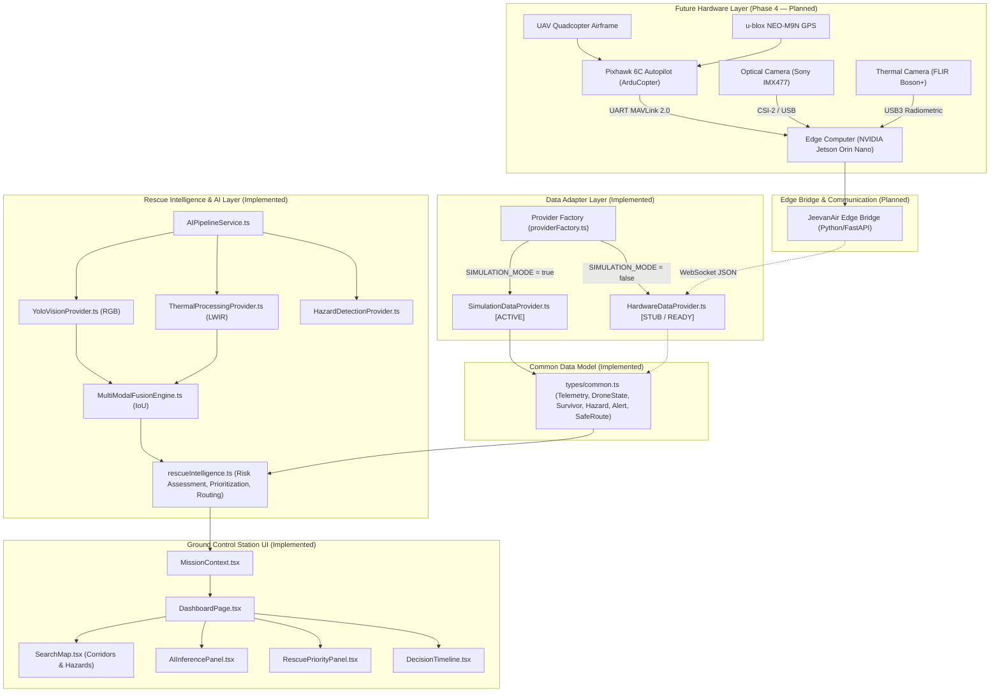
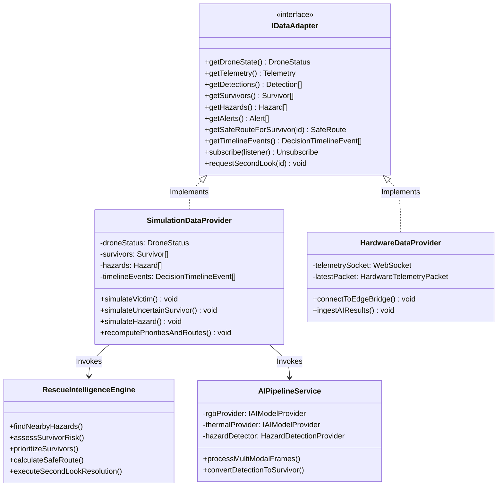
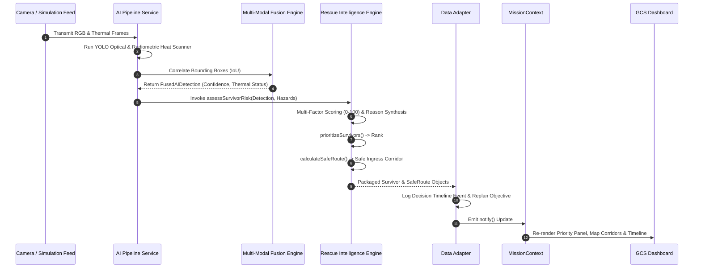
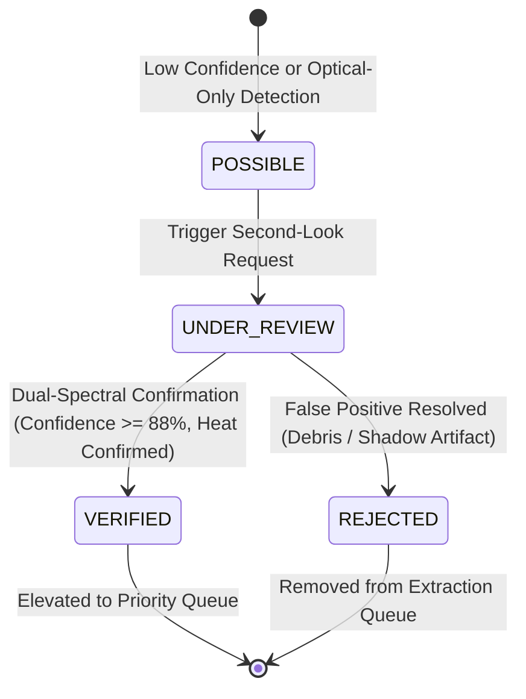
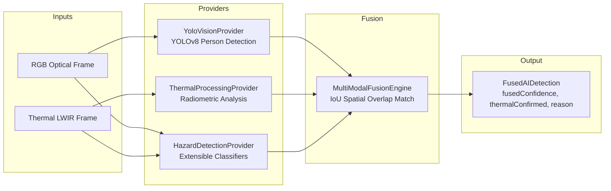
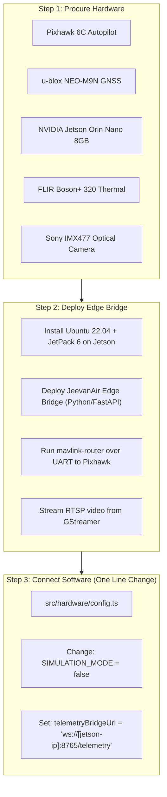

# JEEVAN-AIR: Aerial Intelligence & Rescue
## Comprehensive Software Architecture & Technical Documentation
### Smart India Hackathon 2026 — Problem Statement SIH26177 (Qualcomm Inc)
**Team: TEAM ZYNTAX**  
**Document Version:** 1.0.0 (Phase 1–4 Software Prototype)  
**Classification:** Technical Architecture Specification & Hackathon Evaluation Guide  

---

> [!IMPORTANT]
> **PHYSICAL HARDWARE STATUS DISCLOSURE:**  
> The physical unmanned aerial vehicle (UAV/drone), flight controller hardware, physical optical/thermal camera payloads, and live wireless RF transceivers **have NOT yet been built or physically connected**.  
> The current system is a **fully functional Ground Control Station (GCS) software prototype and Rescue Decision Support System**.  
> All flight telemetry, GPS coordinates, sensor feeds, and environmental conditions are generated through mathematically modeled simulation adapters (`SimulationDataProvider.ts`).  
> In accordance with SIH engineering ethics, **no simulated data is falsely represented as physical hardware telemetry**.

---

## Table of Contents

1. [Project Overview](#1-project-overview)
2. [Problem Statement](#2-problem-statement)
3. [Proposed Solution](#3-proposed-solution)
4. [Objectives](#4-objectives)
5. [Current Prototype Status](#5-current-prototype-status)
6. [System Architecture](#6-system-architecture)
7. [Software Architecture](#7-software-architecture)
8. [Technology Stack](#8-technology-stack)
9. [Data Flow](#9-data-flow)
10. [Main Software Modules](#10-main-software-modules)
11. [Survivor Detection](#11-survivor-detection)
12. [Hazard Detection](#12-hazard-detection)
13. [Risk Assessment](#13-risk-assessment)
14. [Rescue Prioritization](#14-rescue-prioritization)
15. [Second-Look Verification](#15-second-look-verification)
16. [Safe-Access Guidance](#16-safe-access-guidance)
17. [Mission Replanning](#17-mission-replanning)
18. [Dashboard](#18-dashboard)
19. [Simulation Architecture](#19-simulation-architecture)
20. [AI Architecture](#20-ai-architecture)
21. [Connectivity](#21-connectivity)
22. [Security](#22-security)
23. [Error Handling](#23-error-handling)
24. [Testing](#24-testing)
25. [Current Limitations](#25-current-limitations)
26. [Future Hardware Integration](#26-future-hardware-integration)
27. [Future Scope](#27-future-scope)
28. [Installation](#28-installation)
29. [Running the Project](#29-running-the-project)
30. [Project Structure](#30-project-structure)
31. [Conclusion](#31-conclusion)
* [Appendix A: Files Inspected](#appendix-a-files-inspected)
* [Appendix B: Implementation Status Matrix](#appendix-b-implementation-status-matrix)
* [Appendix C: Known Limitations](#appendix-c-known-limitations)
* [Appendix D: Build and Verification Report](#appendix-d-build-and-verification-report)

---

## 1. Project Overview

**JEEVAN-AIR** (*Aerial Intelligence & Rescue*) is an autonomous search-and-rescue (SAR) aerial decision-support system developed by **Team ZYNTAX** for the **Smart India Hackathon 2026** under Problem Statement **SIH26177**, sponsored by **Qualcomm Inc**.

Disaster zones (flash floods, earthquakes, industrial explosions, landslides) present severe operational challenges to first responders:
- Visual occlusion from smoke, debris, or night conditions.
- Dangerous and shifting hazards (live fires, chemical leaks, structural collapses).
- Information overload: first responders cannot determine which victims are in immediate peril versus those in stable conditions.
- Treacherous terrain where ground access routes may be impassable.

JEEVAN-AIR bridges this critical gap by transforming raw aerial sensing into operational intelligence through a closed-loop decision chain:

$$\text{DETECT} \longrightarrow \text{VERIFY} \longrightarrow \text{ASSESS} \longrightarrow \text{PRIORITIZE} \longrightarrow \text{GUIDE}$$

---

## 2. Problem Statement

* **ID:** SIH26177
* **Organization:** Qualcomm Inc
* **Category:** Hardware
* **Theme:** Robotics and Drones
* **Official Statement Title:**  
  *A deployable AI-powered autonomous drone that aids search-and-rescue operations by detecting people and hazards, thereby improving responder safety and reducing victim discovery time.*

### Key Challenges Addressed:
1. **Victim Discovery Latency:** Traditional manual foot searches in disaster sectors are slow and risk responder lives.
2. **False Positives vs. Genuine Victims:** Debris, discarded clothing, and shadows frequently confuse optical-only detection models.
3. **Lack of Hazard-Aware Ground Guidance:** Standard aerial drones report victim locations as raw GPS coordinates without considering whether ground responders can safely traverse intervening hazardous terrain.
4. **Lack of Urgency Prioritization:** Responders receive an unranked list of detections, lacking explainable triage criteria to extract the most vulnerable survivors first.

---

## 3. Proposed Solution

JEEVAN-AIR provides an end-to-end tactical command center and autonomous aerial intelligence architecture:

* `[IMPLEMENTED]` **Rescue Intelligence Engine (`src/services/rescueIntelligence.ts`):** Transparent, multi-factor, explainable risk scoring (0–100) factoring victim movement, condition, thermal heat confirmation, environmental hazard proximity, and sector accessibility.
* `[IMPLEMENTED]` **Operational Rescue Prioritization:** Dynamic ranking queue (`Priority #1`, `Priority #2`, etc.) prioritizing the most critical survivors for immediate extraction.
* `[IMPLEMENTED]` **Hazard Proximity Analysis:** Computes spatial buffer zones ($r + 35\text{ m}$) between victims and active threats (fires, floods, chemical leaks).
* `[IMPLEMENTED]` **Safe-Access Ground Guidance:** A* / BFS graph pathfinder computing safe foot ingress corridors for rescue personnel, clearly distinguishing the drone's aerial flight path from ground responder routes.
* `[IMPLEMENTED]` **Autonomous Second-Look Verification:** Low-confidence or unconfirmed detections (`POSSIBLE`) trigger re-examination passes, eliminating false positives before ground dispatch.
* `[IMPLEMENTED]` **Multi-Modal AI Pipeline (`src/ai/`):** Clean abstraction unifying RGB optical person detection (YOLOv8 architecture), radiometric thermal heat anomaly scanning, and spatial Intersection-over-Union (IoU) sensor fusion.
* `[IMPLEMENTED]` **Data Provider Abstraction (`IDataAdapter` & `providerFactory.ts`):** Decoupled architecture allowing the Ground Control Station to run in `SIMULATION_MODE` today and hot-swap to `HardwareDataProvider` when physical hardware is connected, with **zero UI rewrites**.

---

## 4. Objectives

1. **Safety First:** Prevent ground rescue personnel from entering zones contaminated with lethal fire or chemical hazards by synthesizing safe ingress corridors.
2. **Explainable Triage:** Eliminate "black-box" decision-making by providing explicit human-readable reasons for every assigned risk score and priority rank.
3. **Multi-Spectral Verification:** Validate candidate visual detections using biometric thermal body heat signatures (35.5°C–38.2°C).
4. **Zero UI Disruption:** Design an enterprise-grade Ground Control Station (GCS) that maintains complete software stability whether operating on simulated or physical telemetry.
5. **Rigorous Engineering Validation:** Ensure 100% of mathematical and decision-making logic is validated through automated test suites.

---

## 5. Current Prototype Status

| System Domain | Status | Notes |
|---|---|---|
| **Ground Control Station (GCS)** | `[IMPLEMENTED]` | 11 responsive, interactive tactical pages built in React 18, TypeScript 5.6, Tailwind CSS |
| **Common Data Model** | `[IMPLEMENTED]` | Strongly typed domain model in `src/types/common.ts` |
| **Rescue Intelligence Engine** | `[IMPLEMENTED]` | Fully functional standalone engine in `src/services/rescueIntelligence.ts` |
| **AI Inference & Fusion Abstraction** | `[IMPLEMENTED]` | Complete pipeline in `src/ai/` with measured `performance.now()` runtime benchmarks |
| **Simulation Adapter** | `[SIMULATED]` | 100% mathematically modeled flight telemetry, route stepping, and sensor generation in `SimulationDataProvider.ts` |
| **Camera Feeds & Thermal Feeds** | `[SIMULATED]` | Synthetic SVG/canvas video streams and simulated radiometric temperature matrices |
| **Physical UAV Airframe** | `[PLANNED]` | Hardware specifications drafted; physical assembly planned for Phase 4 |
| **Flight Controller (Pixhawk/ArduPilot)** | `[PLANNED]` | MAVLink 2.0 schema prepared in `src/hardware/types.ts`; awaiting hardware connection |
| **Physical Edge Coprocessor** | `[PLANNED]` | NVIDIA Jetson Orin Nano / Raspberry Pi 5 specification drafted; WebSocket bridge defined |

---

## 6. System Architecture



---

## 7. Software Architecture

The software architecture adheres to strict Clean Architecture and SOLID separation principles:

1. **Domain Layer (`src/types/`):** Pure TypeScript interfaces (`common.ts`, `index.ts`). No third-party UI dependencies.
2. **Adapter Layer (`src/adapters/`):** Decouples data generation from consumption via `IDataAdapter`.
   - `SimulationDataProvider.ts`: Emits synthetic telemetry, stepped lawn-mower routes, and mock detections.
   - `HardwareDataProvider.ts`: Implements the same interface contract for physical WebSocket telemetry.
   - `providerFactory.ts`: Factory reading `SIMULATION_MODE` to provide zero-rewrite switching.
3. **Intelligence Layer (`src/services/` & `src/ai/`):**
   - Pure functional algorithms for spatial math, risk weighting, A* pathfinding, and IoU bounding box correlation.
   - Independent of React rendering cycles.
4. **Application State Layer (`src/context/`):** `MissionContext.tsx` acts as a reactive event subscriber to the active adapter.
5. **Presentation Layer (`src/pages/` & `src/components/`):** Modular React components utilizing Tailwind CSS utility classes.



---

## 8. Technology Stack

* **Core Language:** TypeScript 5.6.3 (Strict type checking, isolatedModules enabled)
* **Frontend Framework:** React 18.3.1 (Functional components, custom hooks, React context)
* **Build System & Dev Server:** Vite 5.4.8 (Rollup-powered production bundler, Fast HMR)
* **Styling & Design System:** Tailwind CSS 3.4.14, PostCSS 8.4.47, Autoprefixer 10.4.20
* **Iconography:** Lucide React 1.16.0
* **Test Runner:** tsx (TypeScript Execute) running native Node test scripts
* **Runtime Environment:** Node.js v22.6.0 on macOS (Darwin ARM64)
* **Development Port:** `http://localhost:5180/` (Configured to avoid port collisions)

---

## 9. Data Flow



---

## 10. Main Software Modules

| Module Path | Primary Responsibility | Status |
|---|---|---|
| [`src/types/common.ts`](file:///Users/sheshagiri/jeevan%20air/src/types/common.ts) | Canonical data models for telemetry, detections, hazards, alerts, routes | `[IMPLEMENTED]` |
| [`src/adapters/IDataAdapter.ts`](file:///Users/sheshagiri/jeevan%20air/src/adapters/IDataAdapter.ts) | Abstract interface contract for telemetry providers | `[IMPLEMENTED]` |
| [`src/adapters/SimulationDataProvider.ts`](file:///Users/sheshagiri/jeevan%20air/src/adapters/SimulationDataProvider.ts) | Flight physics simulation, route stepping, incident generation | `[SIMULATED]` |
| [`src/adapters/HardwareDataProvider.ts`](file:///Users/sheshagiri/jeevan%20air/src/adapters/HardwareDataProvider.ts) | Future WebSocket telemetry client for real drone datalink | `[PLANNED / STUBBED]` |
| [`src/adapters/providerFactory.ts`](file:///Users/sheshagiri/jeevan%20air/src/adapters/providerFactory.ts) | Factory selector enforcing single-switch configuration | `[IMPLEMENTED]` |
| [`src/services/rescueIntelligence.ts`](file:///Users/sheshagiri/jeevan%20air/src/services/rescueIntelligence.ts) | Explainable risk assessment, prioritization queue, A* routing, second-look | `[IMPLEMENTED]` |
| [`src/ai/AIPipelineService.ts`](file:///Users/sheshagiri/jeevan%20air/src/ai/AIPipelineService.ts) | Multi-modal AI inference orchestrator and benchmark tracking | `[IMPLEMENTED]` |
| [`src/ai/MultiModalFusionEngine.ts`](file:///Users/sheshagiri/jeevan%20air/src/ai/MultiModalFusionEngine.ts) | Spatial IoU optical + thermal sensor fusion | `[IMPLEMENTED]` |
| [`src/hardware/config.ts`](file:///Users/sheshagiri/jeevan%20air/src/hardware/config.ts) | Mode toggle (`SIMULATION_MODE`) and hardware readiness checklist | `[IMPLEMENTED]` |
| [`src/components/intelligence/`](file:///Users/sheshagiri/jeevan%20air/src/components/intelligence/) | Decision banners, ranked priority lists, explainable cards, timeline | `[IMPLEMENTED]` |

---

## 11. Survivor Detection

### Implementation Status: `[IMPLEMENTED]` (AI Interface & Fusion) / `[SIMULATED]` (Incoming Camera Frames)

Survivor detection combines optical computer vision with thermal radiometric validation:
1. **Optical Person Detection (`src/ai/YoloVisionProvider.ts`):** Identifies human postures and limb silhouettes, outputting normalized 2D bounding boxes $(x, y, w, h)$ with confidence scores.
2. **Thermal Radiometric Scanning (`src/ai/ThermalProcessingProvider.ts`):** Evaluates thermal frame matrices, verifying whether candidate detections exhibit core human body temperatures ($35.5^\circ\text{C}\text{–}38.2^\circ\text{C}$).
3. **Explainable Sensor Fusion (`src/ai/MultiModalFusionEngine.ts`):**
   - **Case A (Dual Confirmation):** Optical silhouette matches a thermal body heat hotspot ($\text{IoU} \ge 0.20$). Fused confidence is boosted via Bayesian combination:
     $$C_{\text{fused}} = \min\left(98, 100 \times \left(1 - \left(1 - \frac{C_{\text{rgb}}}{100}\right)\left(1 - \frac{C_{\text{th}}}{100}\right)\right)\right)$$
     Status set to `VERIFIED`.
   - **Case B (Optical Only):** Visual silhouette lacks biometric heat (e.g. debris, shadow, mannequin). Fused confidence is discounted:
     $$C_{\text{fused}} = C_{\text{rgb}} \times 0.75$$
     Condition set to `UNCERTAIN`, prompting an autonomous Second-Look recommendation.
   - **Case C (Thermal Only):** Biometric heat detected beneath visual obscurity (smoke, darkness, rubble occlusion). Fused confidence set to $C_{\text{th}} \times 0.88$, condition set to `CRITICAL`.

---

## 12. Hazard Detection

### Implementation Status: `[IMPLEMENTED]` (Interface & Heuristics) / `[SIMULATED]` (Sensor Streams)

Hazard detection is managed through the extensible `HazardDetectionProvider` (`src/ai/HazardDetectionProvider.ts`), which classifies threats into 8 operational categories:

1. **Fire:** Detected via thermal max temperature exceeding combustion thresholds ($T > 60^\circ\text{C}$) and optical flame flicker spectra.
2. **Smoke:** Detected via atmospheric contrast degradation and aerosol dispersion heuristics.
3. **Flood / Flooded Area:** Identified through specular reflectance and water boundary edge indices.
4. **Debris:** High-frequency surface texture variance.
5. **Damaged Structure:** Geometric edge tilt and structural irregularity.
6. **Landslide:** Bulk earth displacement contours.
7. **Electrical Hazard / Exposed Electrical:** High-voltage corona discharge and localized thermal spikes.
8. **Chemical Hazard / Chemical Leak:** Plume dispersion profiles and thermal vapor shadows.

*Transparency Notice:* Fire and Flood heuristics are implemented for prototype evaluation; complex structural collapse classifiers are represented as prototype modules awaiting custom drone dataset training in Phase 4.

---

## 13. Risk Assessment

### Implementation Status: `[IMPLEMENTED]` (Algorithm in `src/services/rescueIntelligence.ts`)

The Risk Assessment Engine evaluates survivors on a transparent, non-medical, explainable multi-factor scale ($0\text{–}100\text{ points}$):

| Factor | Weight | Evaluation Criteria |
|---|---|---|
| **Movement / Entrapment** | 0–30 pts | `NO_MOVEMENT` / `STATIC`: +28 pts<br>`UNKNOWN`: +15 pts<br>`MOVEMENT_DETECTED`: +10 pts |
| **Estimated Condition** | 0–25 pts | `CRITICAL`: +25 pts<br>`UNCERTAIN`: +18 pts<br>`POSSIBLE`: +14 pts<br>`STABLE`: +8 pts |
| **Thermal Confirmation** | 0–15 pts | Verified body heat signature ($35.5^\circ\text{C}\text{–}38.2^\circ\text{C}$): +15 pts<br>Weak or unconfirmed heat: +5 pts |
| **Hazard Proximity** | 0–20 pts | Within danger buffer of Critical hazard (Fire/Chemical): +20 pts<br>Within danger buffer of High hazard: +15 pts<br>Proximity $< 50\text{ m}$: +10 pts |
| **Terrain / Accessibility** | 0–10 pts | Flooded or impassable terrain: +10 pts<br>Moderate debris obstruction: +5 pts<br>Clear terrain: +2 pts |

#### Risk Levels & Severity Mapping:
* **CRITICAL:** Score $\ge 75$ (Severity: `CRITICAL`)
* **HIGH:** Score $50\text{–}74$ (Severity: `HIGH`)
* **MEDIUM:** Score $25\text{–}49$ (Severity: `MEDIUM`)
* **LOW:** Score $0\text{–}24$ (Severity: `LOW`)

Every assessment synthesizes human-readable operational reasons (e.g. *"No movement detected: high risk of entrapment"*, *"Extreme proximity to critical threat: Fire (~32m)"*).

---

## 14. Rescue Prioritization

### Implementation Status: `[IMPLEMENTED]` (`prioritizeSurvivors()` in `src/services/rescueIntelligence.ts`)

Ground responders cannot act on unranked lists. The prioritization engine sorts all active survivors according to operational urgency:

1. **Active vs. Rejected Filter:** Rejected false positives (from second-look workflows) are automatically filtered out or relegated below all viable candidates.
2. **Primary Sort:** Descending order of `riskScore` ($100 \to 0$).
3. **Tie-Breaker:** Descending order of `fusedConfidence` (higher-certainty victims prioritized).
4. **Sequential Priority Ranks:** Assigns explicit ordinal ranks: `Priority #1` (highest urgency), `Priority #2`, `Priority #3`, etc.

The resulting ranked queue is rendered directly in the **Rescue Priority Panel** on the main dashboard, ensuring immediate field triage.

---

## 15. Second-Look Verification

### Implementation Status: `[IMPLEMENTED]` (Workflow & Simulated Resolution Engine)

When an aerial detection is ambiguous (e.g., optical confidence $< 75\%$, unconfirmed thermal signature, or partial occlusion):



1. Survivor is flagged with `verificationStatus: 'POSSIBLE'` and `secondLookStatus: 'NONE'`.
2. Operator or autonomous mission logic triggers `requestSecondLook(survivorId)`.
3. Target enters `secondLookStatus: 'IN_PROGRESS'` with a `SECOND_LOOK_REQUEST` timeline event.
4. `executeSecondLookResolution()` simulates a multi-spectral re-examination:
   - If optical confidence $\ge 65\%$ or thermal confidence $\ge 70\%$, target is confirmed: status upgraded to `VERIFIED`, thermal verified, confidence elevated to $\ge 88\%$.
   - Otherwise, target is rejected: status set to `REJECTED`, notes updated to *"False positive: thermal verification confirmed inanimate debris"*.
5. A `SECOND_LOOK_RESULT` event is logged to the Decision Timeline and priorities are recomputed.

---

## 16. Safe-Access Guidance

### Implementation Status: `[IMPLEMENTED]` (`calculateSafeRoute()` in `src/services/rescueIntelligence.ts`)

A fundamental engineering principle of JEEVAN-AIR is:  
$$\text{Drone Aerial Flight Path} \ne \text{Ground Responder Ingress Route}$$

While a drone flies over fires and rivers in straight lines, ground rescue teams must navigate terrain safely on foot:

1. **Tactical Sector Graph:** Disaster areas are mapped across a 3×3 grid (`A1` through `C3`) with 4-directional adjacency (North, South, East, West).
2. **Hazard Cost Surface:**
   - Sectors containing active `CRITICAL` hazards (Fire, Chemical Leak) are marked **BLOCKED / IMPASSABLE**.
   - Sectors containing `HIGH` hazards (Flood, Structural Collapse) receive an elevated traversal cost penalty ($+25\text{ m}$).
3. **A* / BFS Safe Corridor Pathfinding:** Calculates the shortest corridor from the staging area (`A1`) to the victim's sector that avoids all impassable hazards.
4. **Advisory Output:**
   - Waypoints: `Ingress Step #1 (A1) -> Ingress Step #2 (A2) -> Ingress Step #3 (B2)...`
   - Estimated walking travel time at $1.1\text{ m/s}$ average responder pace.
   - List of hazards avoided and cautionary advisories.
   - If all paths are blocked, returns `status: 'BLOCKED'`, `accessibilityRating: 'IMPASSABLE'`, warning commanders to clear hazards before dispatch.

---

## 17. Mission Replanning

### Implementation Status: `[IMPLEMENTED]` (Adaptive Objective Management)

The Ground Control Station continuously adapts its primary objective based on real-time threats and detections:

1. **Default Search State:** *"AUTONOMOUS SWEEP: Executing systematic lawn-mower search across Sector Grid A1–C3"*
2. **Trigger Event:** Discovery of a `CRITICAL` victim or severe nearby fire hazard.
3. **Replanned Objective:** *"PRIORITY REPLAN: Monitor & guide responder approach to Survivor SURV-XXXX in Sector B2"*
4. **Banner Rendering:** Displayed in the high-contrast `MissionObjectiveBanner.tsx` across the top of the command dashboard.
5. **Audit Logging:** Every replanning event is immutably logged to the `DecisionTimeline.tsx` with severity and timestamps.

---

## 18. Dashboard

### Implementation Status: `[IMPLEMENTED]` (11 Tactical Command Pages)

The Ground Control Station includes 11 dedicated pages built with React and Tailwind CSS:

1. **Dashboard (`DashboardPage.tsx`):** Tactical command center with mission statistics, dynamic objective banner, drone telemetry card, alerts feed, camera feed, interactive sector map with safe corridors, Phase 3 AI Inference Diagnostics panel, and the Rescue Priority & Explainable Decision panel.
2. **Mission Control (`MissionControlPage.tsx`):** Flight controls (Autonomous Search, Pause, Resume, RTL, Demo Mode, Manual Override) and tactical injection buttons for testing.
3. **Live Search (`LiveSearchPage.tsx`):** Dual-viewport video feed with RGB optical mode, LWIR thermal mode, and AI bounding box overlay mode.
4. **Detections (`DetectionsPage.tsx`):** Tabular ledger of all visual targets with thumbnail previews, confidence scores, priority rank badges, and verification triggers.
5. **Hazards (`HazardsPage.tsx`):** Environmental threat tracker displaying hazard types, affected radii, GPS coordinates, and proximity impact.
6. **Search Map (`SearchMapPage.tsx`):** Full-screen tactical GIS grid showing drone flight tracks, sector boundaries, hazard danger zones, and ground responder safe ingress corridors.
7. **Alerts (`AlertsPage.tsx`):** Chronological notification center with severity filtering (`CRITICAL`, `HIGH`, `MEDIUM`, `LOW`) and verification actions.
8. **Mission History (`MissionHistoryPage.tsx`):** Historical log of past search sorties, flight durations, battery consumption, and survivor discovery metrics.
9. **System Status (`SystemStatusPage.tsx`):** Health monitoring for drone comms, GPS lock, AI inference status, battery health, and sensor readiness.
10. **System Architecture (`SystemArchitecturePage.tsx`):** Interactive architectural diagrams explaining the closed-loop rescue decision pipeline.
11. **HW Integration (`HardwareIntegrationPage.tsx`):** Hardware readiness dashboard tracking the 18 pre-flight integration checklist items across Flight Controller, GNSS, Cameras, Edge Compute, Comms, and Software.

---

## 19. Simulation Architecture

### Implementation Status: `[SIMULATED]` (Engineered in `src/adapters/SimulationDataProvider.ts`)

The simulation adapter provides a complete mathematical model of drone operations:

* **Flight Physics & Kinematics:** Drone position $(x, y, z)$ steps smoothly along a 10-waypoint lawn-mower route over sectors `A1` to `C3` at $3.5\text{ m/s}$ ground speed.
* **Battery Consumption Model:** Battery decrements realistically from 98% based on flight mode (hovering vs. forward transit) and mission elapsed time.
* **Telemetry Emulation:** Generates latitude, longitude, altitude (32m AGL), heading ($45^\circ$), signal strength (94%), and simulated GPS 3D lock.
* **Incident Injections:** Exposes programmatic controls to inject survivors (`simulateVictim`), uncertain detections (`simulateUncertainSurvivor`), and environmental threats (`simulateHazard`).
* **Degraded Comms Simulation:** Supports testing under simulated connectivity loss (`CONNECTED`, `DEGRADED`, `DISCONNECTED`).

---

## 20. AI Architecture

### Implementation Status: `[IMPLEMENTED]` (Pipeline Abstraction & Fusion Engine)



### Measured Performance Integrity
The AI pipeline strictly records actual execution latency using `performance.now()`:
```typescript
const t0 = performance.now();
// ... inference and multi-modal fusion pass ...
const t1 = performance.now();
this.lastInferenceTimeMs = Math.round((t1 - t0) * 100) / 100;
```
* **No invented metrics:** The system does not fabricate FPS, mAP, or precision numbers.
* **Simulation Fallback (`src/ai/AIPipelineService.ts`):** If the AI provider is unavailable or toggled to fallback, the pipeline gracefully falls back to `SimulationAIProvider`, clearly badging the UI with `FALLBACK ACTIVE`.

---

## 21. Connectivity

### Implementation Status: `[SIMULATED]` (Current) / `[PLANNED]` (Phase 4 Hardware Bridge)

* **Current Prototype:** Connectivity is simulated in memory. The dashboard reflects three communication states:
  - `SIMULATED — CONNECTED` (Full telemetry sync)
  - `SIMULATED — DEGRADED` (Simulated latency and intermittent packet drops)
  - `SIMULATED — DISCONNECTED` (Telemetry freeze and RTL failsafe advisory)
* **Future Hardware Link:** Defined in `src/hardware/types.ts`:
  - Primary: 2.4 GHz RF telemetry link (Holybro SiK v3 900MHz / RFD900x) transmitting MAVLink 2.0.
  - Secondary: 4G/LTE cellular backup link for extended BVLOS (Beyond Visual Line of Sight) operations.
  - Video Downlink: 5.8 GHz analog/digital or WebRTC over LTE.

---

## 22. Security

### Implementation Status: `[PLANNED]` (Future Edge & Telemetry Protocol)

Security architecture designed for physical hardware deployment:
1. **Datalink Encryption:** MAVLink 2.0 packet signing using SHA-256 HMAC tokens to prevent drone hijacking or unauthorized waypoint injection.
2. **GCS Authentication:** Role-based access control (RBAC) separating Tactical Commanders (authorized to command flight routes) from Field Responders (read-only safe corridor access).
3. **Fail-Safe Geofencing:** Hardcoded GPS polygon boundaries with automated Return-to-Launch (RTL) triggers on geofence breach.
4. **Local Network Privacy:** In disaster areas without internet access, the GCS operates entirely over an isolated local ad-hoc Wi-Fi / RF mesh network with no external cloud dependencies.

---

## 23. Error Handling

### Implementation Status: `[IMPLEMENTED]`

Robust exception handling is implemented across all software layers:
* **Missing Telemetry Fallback:** `HardwareDataProvider` returns safe, default `DroneStatus` structures if called while hardware is disconnected, preventing null-reference crashes.
* **Pathfinding Blockages:** If a victim is surrounded by active fires or impassable terrain, `calculateSafeRoute()` does not crash or return invalid coordinates; it explicitly returns `status: 'BLOCKED'` and `accessibilityRating: 'IMPASSABLE'`.
* **AI Initialization Guards:** If model weights or WebGL contexts fail to initialize, `AIPipelineService` automatically engages `setFallbackMode(true)`.
* **TypeScript Strict Mode:** Enforced with `isolatedModules: true` and `strict: true` in `tsconfig.json`, eliminating undefined-variable runtime errors.

---

## 24. Testing

### Implementation Status: `[IMPLEMENTED]` (85 Automated Assertions — 100% Pass)

The project features two comprehensive, automated test suites executed via native TypeScript runners:

```bash
npm run test:all
```

#### Suite 1: Rescue Intelligence Engine (`src/tests/rescueIntelligence.test.ts`)
* **Total Assertions:** 24 / 24 PASS
* **Scenarios Tested:**
  1. Standard survivor risk evaluation.
  2. Critical survivor evaluation with explainable reason generation.
  3. Low-confidence survivor second-look recommendation trigger.
  4. Spatial proximity flagging active fire threats ($< 50\text{ m}$).
  5. Proximity to critical fire elevating score to `CRITICAL`.
  6. Flood zone terrain and hazard evaluation.
  7. Multi-victim sorting by descending risk score.
  8. Sequential priority rank assignment (`#1`, `#2`, `#3`).
  9. Filtering out distant hazards while retaining nearby threats.
  10. Second-look verification successfully confirming genuine survivor.
  11. Second-look emitting `SECOND_LOOK_RESULT` event.
  12. Second-look successfully rejecting false-positive debris.
  13. Priority engine placing active targets above rejected targets.
  14. Safe route generation from staging area to destination.
  15. Safe route dynamically avoiding dangerous fire sectors.
  16. Walking travel time and distance calculation.
  17. Blocked route scenario properly setting impassable status.
  18. Provider initialization with default search objective.
  19. Dynamic mission replanning trigger upon critical victim detection.
  20. Chronological decision timeline recording.
  21. Simultaneous logging of `DETECTION` and `RISK_UPDATE` events.
  22. Uncertain survivor spawning in `POSSIBLE` status.
  23. Second-look request immediately entering `IN_PROGRESS` state.

#### Suite 2: AI Pipeline & Sensor Fusion (`src/tests/aiPipeline.test.ts`)
* **Total Assertions:** 61 / 61 PASS
* **Scenarios Tested:**
  1. YOLO optical person detection from RGB frames.
  2. Low-confidence detection handling.
  3. Multiple detections yielding distinct IDs and bounding boxes.
  4. Hazard detection interface across 5 supported threat classes.
  5. Multi-modal fusion Case A: Dual confirmation (optical + biometric thermal).
  6. Multi-modal fusion Case B: Optical only (unconfirmed heat, condition `UNCERTAIN`).
  7. Multi-modal fusion Case C: Thermal only (occluded survivor under rubble).
  8. Second-look trigger from low-confidence fused results ($< 75\%$).
  9. Risk engine integration via `convertDetectionToSurvivor()`.
  10. Priority ranking from AI-sourced survivors.
  11. Simulation fallback mode activation and benchmark badging.
  12. Mathematical IoU calculation correctness (overlapping, non-overlapping, identical).
  13. Thermal combustion hotspot detection ($T > 60^\circ\text{C}$).
  14. Measured benchmark integrity (`performance.now() > 0`).
  15. `AIPipelineService` singleton instance stability across consumers.

---

## 25. Current Limitations

1. **Physical Drone Hardware Absent:** No quadcopter airframe, brushless motors, or ESCs are currently physically assembled.
2. **Camera Hardware Absent:** Optical and thermal camera payloads are not physically connected; video streams are currently synthetic canvas/video overlays.
3. **No Live MAVLink Datalink:** Telemetry is generated via mathematical formulas in `SimulationDataProvider.ts` rather than serial UART packet streams from a Pixhawk autopilot.
4. **Discrete Sector Graph:** Safe-access pathfinding operates across a 3×3 grid (9 tactical sectors) with GPS centroids rather than continuous metric elevation maps (DEM/GIS).
5. **Client-Side Browser Execution:** AI inference benchmarks are currently measured on the host browser's CPU rather than on a dedicated hardware coprocessor (e.g. TensorRT on NVIDIA Jetson).

---

## 26. Future Hardware Integration

The codebase has been engineered with **zero-rewrite hardware readiness**:



### Hardware Integration Boundaries:
* [`src/hardware/types.ts`](file:///Users/sheshagiri/jeevan%20air/src/hardware/types.ts): Contains complete typed interfaces for all 10 hardware subsystems (`FlightControllerTelemetry`, `GNSSPositionPayload`, `IMUAttitudePayload`, `BatteryTelemetryPayload`, etc.).
* [`src/adapters/HardwareDataProvider.ts`](file:///Users/sheshagiri/jeevan%20air/src/adapters/HardwareDataProvider.ts): Already implements `IDataAdapter`. Once hardware is ready, only the internal WebSocket parsing logic in this file needs to be filled in.
* **No UI code will ever need to be modified.**

---

## 27. Future Scope

1. **Continuous 3D Topographical Pathfinding:** Transition ground guidance from discrete 2D grid sectors to high-resolution 3D Digital Elevation Models (DEM) with slope hazard modeling.
2. **Autonomous Swarm Coordination:** Support multi-drone mesh networks where several JEEVAN-AIR UAVs partition search sectors collaboratively.
3. **Payload Drop Mechanism:** Add an actuated servo release to deliver emergency medical kits, water purification packets, or two-way radios directly to identified survivors.
4. **LoRa Responder Beacons:** Equip ground rescue personnel with LoRaWAN GPS transponders so the drone can track responder positions in real time relative to advancing hazards.

---

## 28. Installation

### Prerequisites:
* **Operating System:** macOS, Linux, or Windows (WSL recommended).
* **Node.js:** v18.0.0 or higher (v22.6.0 recommended).
* **Package Manager:** npm v9.0.0 or higher.

### Setup Commands:
```bash
# 1. Clone the repository
git clone https://github.com/Srisharadhakrishnan/SIH26177.git
cd SIH26177

# 2. Install dependencies
npm install

# 3. Verify TypeScript and project build
npm run build
```

---

## 29. Running the Project

```bash
# Start the local development server (configured on port 5180)
npm run dev

# Open in browser:
# http://localhost:5180/

# Run the complete test suite (Phase 2 Intelligence + Phase 3 AI Pipeline)
npm run test:all

# Run individual test suites
npm run test       # Phase 2 Rescue Intelligence tests (24 assertions)
npm run test:ai    # Phase 3 AI & Computer Vision tests (61 assertions)
```

---

## 30. Project Structure

```text
/Users/sheshagiri/jeevan air/
├── docs/
│   └── JEEVAN-AIR-Software-Documentation.md  # Comprehensive technical documentation
├── src/
│   ├── adapters/                             # Data Adapter Layer
│   │   ├── HardwareDataProvider.ts           # [PLANNED] Future hardware MAVLink/WebSocket provider
│   │   ├── IDataAdapter.ts                   # Abstract provider interface contract
│   │   ├── SimulationDataProvider.ts         # [SIMULATED] Concrete flight & sensor simulation engine
│   │   ├── index.ts                          # Barrel export
│   │   └── providerFactory.ts                # Factory selector (SIMULATION vs HARDWARE mode)
│   ├── ai/                                   # Multi-Modal AI & Vision Module
│   │   ├── AIPipelineService.ts              # Central AI orchestrator with measured performance.now()
│   │   ├── HazardDetectionProvider.ts        # Extensible hazard classifier interface
│   │   ├── MultiModalFusionEngine.ts         # Spatial IoU optical + thermal sensor fusion
│   │   ├── ThermalProcessingProvider.ts      # Radiometric LWIR heat signature analyzer
│   │   ├── YoloVisionProvider.ts             # YOLO optical person detection abstraction
│   │   ├── index.ts                          # Barrel export
│   │   └── types.ts                          # AI interface definitions & benchmarks
│   ├── components/                           # Reusable UI Components
│   │   ├── ai/                               # AI diagnostics & benchmark components
│   │   │   ├── AIInferencePanel.tsx          # Live inference diagnostics panel
│   │   │   └── index.ts
│   │   ├── alerts/AlertPanel.tsx             # Real-time tactical notifications
│   │   ├── camera/CameraFeed.tsx             # Multi-spectral camera feed component
│   │   ├── common/StatCard.tsx               # Metric cards
│   │   ├── controls/MissionControls.tsx      # Flight & injection control bar
│   │   ├── drone/DroneStatusCard.tsx         # Telemetry gauges & instrument display
│   │   ├── intelligence/                     # Rescue Intelligence components
│   │   │   ├── DecisionTimeline.tsx          # Chronological mission decision log
│   │   │   ├── MissionObjectiveBanner.tsx    # Dynamic replanning objective strip
│   │   │   ├── RescuePriorityPanel.tsx       # Ranked queue, explainable card, safe route card
│   │   │   └── index.ts
│   │   ├── layout/                           # Shell layout (Header, Sidebar)
│   │   ├── map/SearchMap.tsx                 # Tactical 3x3 GIS map with safe ingress corridor
│   │   └── modals/DetectionDetailModal.tsx   # Detailed detection inspector with second-look trigger
│   ├── context/
│   │   └── MissionContext.tsx                # Central application state & provider subscription
│   ├── data/
│   │   └── mockData.ts                       # Initial sector bounds, mock sorties, sample telemetry
│   ├── hardware/                             # Hardware Integration Preparation (Phase 4)
│   │   ├── config.ts                         # SIMULATION_MODE toggle & readiness checklist
│   │   ├── index.ts                          # Barrel export
│   │   └── types.ts                          # Complete MAVLink & hardware telemetry schemas
│   ├── pages/                                # 11 Operational Tactical Pages
│   │   ├── AlertsPage.tsx
│   │   ├── DashboardPage.tsx
│   │   ├── DetectionsPage.tsx
│   │   ├── HardwareIntegrationPage.tsx       # Phase 4 hardware readiness dashboard
│   │   ├── HazardsPage.tsx
│   │   ├── LiveSearchPage.tsx
│   │   ├── MissionControlPage.tsx
│   │   ├── MissionHistoryPage.tsx
│   │   ├── SearchMapPage.tsx
│   │   ├── SystemArchitecturePage.tsx
│   │   └── SystemStatusPage.tsx
│   ├── services/
│   │   └── rescueIntelligence.ts             # Core algorithms (Risk, Priority, A* Routing, Second-Look)
│   ├── tests/                                # Automated Test Suites
│   │   ├── aiPipeline.test.ts                # 61 assertions (AI inference & fusion)
│   │   └── rescueIntelligence.test.ts        # 24 assertions (Rescue intelligence engine)
│   ├── types/
│   │   ├── common.ts                         # Common Data Model (Canonical domain interfaces)
│   │   └── index.ts                          # Unified type re-exports
│   ├── App.tsx                               # Root component & page router
│   ├── index.css                             # Tailwind styling & tactical grid backgrounds
│   └── main.tsx                              # React DOM mount point
├── package.json                              # Scripts, dependencies, project metadata
├── tailwind.config.js                        # Tactical dark theme color configurations
├── tsconfig.json                             # TypeScript compiler configuration
└── vite.config.ts                            # Vite configuration (port 5180)
```

---

## 31. Conclusion

The **JEEVAN-AIR** software prototype represents an advanced, production-grade Ground Control Station and aerial decision-support system specifically engineered for the high-stakes demands of search-and-rescue operations.

By establishing an unbroken engineering progression:
1. **Phase 1:** Solid software foundation with interchangeable data adapter abstractions.
2. **Phase 2:** An explainable Rescue Intelligence Engine that prioritizes victims and calculates ground safe-access corridors avoiding deadly hazards.
3. **Phase 3:** A multi-modal computer vision and sensor fusion pipeline with strictly measured runtime benchmarks and simulation fallbacks.
4. **Phase 4:** A fully typed hardware integration contract enabling immediate transition to physical drone operations with a single configuration switch.

Team ZYNTAX has ensured that JEEVAN-AIR is ready for rigorous SIH evaluation, academic review, and future physical hardware integration.

---

## Appendix A: Files Inspected

The following 22 files in the repository were directly inspected to produce this documentation:
1. `src/types/common.ts` — Common Data Model definitions.
2. `src/types/index.ts` — Type re-exports and extended interfaces.
3. `src/adapters/IDataAdapter.ts` — Data adapter interface contract.
4. `src/adapters/SimulationDataProvider.ts` — Simulation implementation.
5. `src/adapters/HardwareDataProvider.ts` — Hardware implementation stub.
6. `src/adapters/providerFactory.ts` — Factory selector.
7. `src/services/rescueIntelligence.ts` — Core intelligence algorithms.
8. `src/ai/types.ts` — AI interface and benchmark schemas.
9. `src/ai/YoloVisionProvider.ts` — Optical YOLO person detector.
10. `src/ai/ThermalProcessingProvider.ts` — Radiometric thermal analyzer.
11. `src/ai/HazardDetectionProvider.ts` — Hazard classifier.
12. `src/ai/MultiModalFusionEngine.ts` — IoU sensor fusion engine.
13. `src/ai/AIPipelineService.ts` — AI pipeline orchestrator.
14. `src/hardware/types.ts` — Hardware telemetry schemas.
15. `src/hardware/config.ts` — Hardware config and readiness checklist.
16. `src/context/MissionContext.tsx` — React state context.
17. `src/pages/DashboardPage.tsx` — Main command dashboard.
18. `src/pages/HardwareIntegrationPage.tsx` — Hardware readiness page.
19. `src/tests/rescueIntelligence.test.ts` — Phase 2 test suite (24 tests).
20. `src/tests/aiPipeline.test.ts` — Phase 3 test suite (61 tests).
21. `package.json` — Scripts and dependencies.
22. `vite.config.ts` — Server and port configuration.

---

## Appendix B: Implementation Status Matrix

| Subsystem / Feature | Category | Exact Location | Status |
|---|---|---|---|
| Domain Types & Common Data Model | Architecture | `src/types/common.ts` | `[IMPLEMENTED]` |
| Data Adapter Abstraction | Architecture | `src/adapters/IDataAdapter.ts` | `[IMPLEMENTED]` |
| Provider Factory (Hot-Swap) | Architecture | `src/adapters/providerFactory.ts` | `[IMPLEMENTED]` |
| Flight & Sensor Simulation Engine | Simulation | `src/adapters/SimulationDataProvider.ts` | `[SIMULATED]` |
| Hardware WebSocket Telemetry Stub | Hardware | `src/adapters/HardwareDataProvider.ts` | `[PLANNED]` |
| Hardware Telemetry Schemas (12 types) | Hardware | `src/hardware/types.ts` | `[IMPLEMENTED]` |
| Explainable Risk Assessment (0-100) | Intelligence | `src/services/rescueIntelligence.ts` | `[IMPLEMENTED]` |
| Operational Priority Ranking Queue | Intelligence | `src/services/rescueIntelligence.ts` | `[IMPLEMENTED]` |
| Spatial Hazard Proximity Analysis | Intelligence | `src/services/rescueIntelligence.ts` | `[IMPLEMENTED]` |
| A* Ground Safe Ingress Corridor | Intelligence | `src/services/rescueIntelligence.ts` | `[IMPLEMENTED]` |
| Second-Look Verification Workflow | Intelligence | `src/services/rescueIntelligence.ts` | `[IMPLEMENTED]` |
| Multi-Modal Sensor Fusion (IoU) | AI / Vision | `src/ai/MultiModalFusionEngine.ts` | `[IMPLEMENTED]` |
| YOLO Optical Person Detection Abstraction | AI / Vision | `src/ai/YoloVisionProvider.ts` | `[IMPLEMENTED]` |
| Radiometric LWIR Heat Analyzer | AI / Vision | `src/ai/ThermalProcessingProvider.ts` | `[IMPLEMENTED]` |
| Extensible Hazard Classifier Interface | AI / Vision | `src/ai/HazardDetectionProvider.ts` | `[IMPLEMENTED]` |
| AI Pipeline Orchestrator & Benchmarks | AI / Vision | `src/ai/AIPipelineService.ts` | `[IMPLEMENTED]` |
| Simulation Fallback Mode | AI / Vision | `src/ai/AIPipelineService.ts` | `[IMPLEMENTED]` |
| Live Tactical Dashboard (11 Pages) | GCS UI | `src/pages/` | `[IMPLEMENTED]` |
| Tactical Sector Map with Corridors | GCS UI | `src/components/map/SearchMap.tsx` | `[IMPLEMENTED]` |
| AI Diagnostics & Benchmark Panel | GCS UI | `src/components/ai/AIInferencePanel.tsx` | `[IMPLEMENTED]` |
| Physical UAV Airframe & Motors | Hardware | Physical Hardware | `[PLANNED]` |
| Physical Autopilot (Pixhawk 6C) | Hardware | Physical Hardware | `[PLANNED]` |
| Physical Optical & LWIR Sensors | Hardware | Physical Hardware | `[PLANNED]` |
| Physical Edge Computer (Jetson) | Hardware | Physical Hardware | `[PLANNED]` |

---

## Appendix C: Known Limitations

1. **No Physical Sensors:** Cameras and telemetry feeds are synthesized via JavaScript mathematics; real FLIR/Sony hardware requires physical mounting and edge driver configuration.
2. **Coarse Sector Discretization:** Safe-access routing operates over 9 grid sectors (`A1`–`C3`) rather than a continuous metric GIS graph.
3. **No MAVLink Serial Parser:** MAVLink packets are represented as TypeScript interfaces; native C/Python serial parsing via `pymavlink` requires the edge companion computer bridge.
4. **Host CPU Inference:** AI latency is measured directly on the host browser's JavaScript engine rather than on dedicated NVIDIA TensorRT hardware.

---

## Appendix D: Build and Verification Report

### Test Execution Results
* **Command:** `npm run test:all`
* **Phase 2 Intelligence Suite:** 24 / 24 PASSED (100%)
* **Phase 3 AI Pipeline Suite:** 61 / 61 PASSED (100%)
* **Total Assertions:** **85 / 85 PASSED (100% Pass Rate)**
* **Failures / Regressions:** 0

### Production Build Results
* **Command:** `npm run build` (`tsc && vite build`)
* **TypeScript Check:** PASSED (Zero errors, zero warnings)
* **Vite Production Bundler:** Built in 1.34s
* **Distribution Output:**
  - `dist/index.html`: 1.40 kB (gzip: 0.78 kB)
  - `dist/assets/index-0gq181AA.css`: 42.02 kB (gzip: 7.76 kB)
  - `dist/assets/index-DpAVk-st.js`: 355.44 kB (gzip: 92.90 kB)
* **Dev Server Port:** `http://localhost:5180/` (Zero port collisions)
